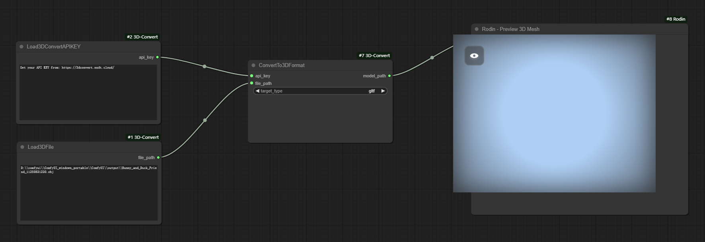

# ComfyUI-3D-convert

**ComfyUI-3D-Covert** is a 3D File Format Conversion Extension based on [3dconvert.nsdt.cloud](https://3dconvert.nsdt.cloud/)-API. It provides a node **ConvertTo3DFormat** currently available, is a powerful tool designed to streamline the conversion of 3D models between a wide array of file formats. 

## Installation

1. **Can be installed directly from [ComfyUI-3D-Covert](https://github.com/nsdtcloud3d/ComfyUI-3D-Convert.git)**

    Clone the repository:
    `git clone https://github.com/nsdtcloud3d/ComfyUI-3D-Convert`
    to your ComfyUI `custom_nodes` directory.

2. **Can be installed from ComfyUI-Manager**

## Features

- **3D-Convert Nodes Overview**
    - 
    
    
- **Extensive Format Support: Easily convert from and to over 30 different 3D file formats, including:**
    - Input Formats: GLB, GLTF, PLY, STL, OBJ, OFF, DAE, FBX, DXF, IFC, XYZ, PCD, LAS, LAZ, STP, STEP, 3DXML, IGES, IGS, SHP, GEOJSON, XAML, PTS, ASC, BREP, FCSTD, BIM, USDZ, PDB, VTK, SVG, WRL, 3DM, 3DS, AMF, 3MF, DWG, JSON, RFA, RVT.
    - Output Formats: GLTF, OBJ, GLB, PLY, STL, XYZ, OFF, DAE, AMF, 3MF, STEP, IGES, FBX.

- **Optimized for AI Model Outputs**
    - Specifically tailored to handle files generated by popular AI tools like ComfyUI-3D-Pack and TripoSR, ensuring that your AI-generated models can be easily converted into the desired format for further processing or integration into other projects.
    
   
## Supporters

- Some functions refer to the following projects:
    - [ComfyUI-3D-Pack](https://github.com/MrForExample/ComfyUI-3D-Pack.git)
    - [ComfyUI-Custom-Scripts](https://github.com/pythongosssss/ComfyUI-Custom-Scripts.git)

## For 3dconvert.nsdt.cloud

**If you don't have a ComfyUI development environment but need to convert 3D files, you can use the following links for 3D file conversion. These resources might be useful for you:**
    

GLTF

<a href="https://3dconvert.nsdt.cloud/glb/to/gltf" target="_blank">GLB转GLTF&nbsp;&nbsp;&nbsp;|&nbsp;&nbsp;</a><a href="https://3dconvert.nsdt.cloud/ply/to/gltf" target="_blank">PLY转GLTF&nbsp;&nbsp;&nbsp;|&nbsp;&nbsp;</a><a href="https://3dconvert.nsdt.cloud/stl/to/gltf" target="_blank">STL转GLTF&nbsp;&nbsp;&nbsp;|&nbsp;&nbsp;</a><a href="https://3dconvert.nsdt.cloud/obj/to/gltf" target="_blank">OBJ转GLTF&nbsp;&nbsp;&nbsp;|&nbsp;&nbsp;</a><a href="https://3dconvert.nsdt.cloud/off/to/gltf" target="_blank">OFF转GLTF&nbsp;&nbsp;&nbsp;|&nbsp;&nbsp;</a><a href="https://3dconvert.nsdt.cloud/dae/to/gltf" target="_blank">DAE转GLTF&nbsp;&nbsp;&nbsp;|&nbsp;&nbsp;</a><a href="https://3dconvert.nsdt.cloud/fbx/to/gltf" target="_blank">FBX转GLTF&nbsp;&nbsp;&nbsp;|&nbsp;&nbsp;</a><a href="https://3dconvert.nsdt.cloud/dxf/to/gltf" target="_blank">DXF转GLTF&nbsp;&nbsp;&nbsp;|&nbsp;&nbsp;</a><a href="https://3dconvert.nsdt.cloud/ifc/to/gltf" target="_blank">IFC转GLTF&nbsp;&nbsp;&nbsp;|&nbsp;&nbsp;</a><a href="https://3dconvert.nsdt.cloud/xyz/to/gltf" target="_blank">XYZ转GLTF&nbsp;&nbsp;&nbsp;|&nbsp;&nbsp;</a><a href="https://3dconvert.nsdt.cloud/pcd/to/gltf" target="_blank">PCD转GLTF&nbsp;&nbsp;&nbsp;|&nbsp;&nbsp;</a><a href="https://3dconvert.nsdt.cloud/las/to/gltf" target="_blank">LAS转GLTF&nbsp;&nbsp;&nbsp;|&nbsp;&nbsp;</a><a href="https://3dconvert.nsdt.cloud/laz/to/gltf" target="_blank">LAZ转GLTF&nbsp;&nbsp;&nbsp;|&nbsp;&nbsp;</a><a href="https://3dconvert.nsdt.cloud/stp/to/gltf" target="_blank">STP转GLTF&nbsp;&nbsp;&nbsp;|&nbsp;&nbsp;</a><a href="https://3dconvert.nsdt.cloud/step/to/gltf" target="_blank">STEP转GLTF&nbsp;&nbsp;&nbsp;|&nbsp;&nbsp;</a><a href="https://3dconvert.nsdt.cloud/3dxml/to/gltf" target="_blank">3DXML转GLTF&nbsp;&nbsp;&nbsp;|&nbsp;&nbsp;</a><a href="https://3dconvert.nsdt.cloud/iges/to/gltf" target="_blank">IGES转GLTF&nbsp;&nbsp;&nbsp;|&nbsp;&nbsp;</a><a href="https://3dconvert.nsdt.cloud/igs/to/gltf" target="_blank">IGS转GLTF&nbsp;&nbsp;&nbsp;|&nbsp;&nbsp;</a><a href="https://3dconvert.nsdt.cloud/shp/to/gltf" target="_blank">SHP转GLTF&nbsp;&nbsp;&nbsp;|&nbsp;&nbsp;</a><a href="https://3dconvert.nsdt.cloud/geojson/to/gltf" target="_blank">GEOJSON转GLTF&nbsp;&nbsp;&nbsp;|&nbsp;&nbsp;</a><a href="https://3dconvert.nsdt.cloud/xaml/to/gltf" target="_blank">XAML转GLTF&nbsp;&nbsp;&nbsp;|&nbsp;&nbsp;</a><a href="https://3dconvert.nsdt.cloud/pts/to/gltf" target="_blank">PTS转GLTF&nbsp;&nbsp;&nbsp;|&nbsp;&nbsp;</a><a href="https://3dconvert.nsdt.cloud/asc/to/gltf" target="_blank">ASC转GLTF&nbsp;&nbsp;&nbsp;|&nbsp;&nbsp;</a><a href="https://3dconvert.nsdt.cloud/brep/to/gltf" target="_blank">BREP转GLTF&nbsp;&nbsp;&nbsp;|&nbsp;&nbsp;</a><a href="https://3dconvert.nsdt.cloud/fcstd/to/gltf" target="_blank">FCSTD转GLTF&nbsp;&nbsp;&nbsp;|&nbsp;&nbsp;</a><a href="https://3dconvert.nsdt.cloud/bim/to/gltf" target="_blank">BIM转GLTF&nbsp;&nbsp;&nbsp;|&nbsp;&nbsp;</a><a href="https://3dconvert.nsdt.cloud/usdz/to/gltf" target="_blank">USDZ转GLTF&nbsp;&nbsp;&nbsp;|&nbsp;&nbsp;</a><a href="https://3dconvert.nsdt.cloud/pdb/to/gltf" target="_blank">PDB转GLTF&nbsp;&nbsp;&nbsp;|&nbsp;&nbsp;</a><a href="https://3dconvert.nsdt.cloud/vtk/to/gltf" target="_blank">VTK转GLTF&nbsp;&nbsp;&nbsp;|&nbsp;&nbsp;</a><a href="https://3dconvert.nsdt.cloud/svg/to/gltf" target="_blank">SVG转GLTF&nbsp;&nbsp;&nbsp;|&nbsp;&nbsp;</a><a href="https://3dconvert.nsdt.cloud/wrl/to/gltf" target="_blank">WRL转GLTF&nbsp;&nbsp;&nbsp;|&nbsp;&nbsp;</a><a href="https://3dconvert.nsdt.cloud/3dm/to/gltf" target="_blank">3DM转GLTF&nbsp;&nbsp;&nbsp;|&nbsp;&nbsp;</a><a href="https://3dconvert.nsdt.cloud/3ds/to/gltf" target="_blank">3DS转GLTF&nbsp;&nbsp;&nbsp;|&nbsp;&nbsp;</a><a href="https://3dconvert.nsdt.cloud/amf/to/gltf" target="_blank">AMF转GLTF&nbsp;&nbsp;&nbsp;|&nbsp;&nbsp;</a><a href="https://3dconvert.nsdt.cloud/3mf/to/gltf" target="_blank">3MF转GLTF&nbsp;&nbsp;&nbsp;|&nbsp;&nbsp;</a><a href="https://3dconvert.nsdt.cloud/dwg/to/gltf" target="_blank">DWG转GLTF&nbsp;&nbsp;&nbsp;|&nbsp;&nbsp;</a><a href="https://3dconvert.nsdt.cloud/json/to/gltf" target="_blank">JSON转GLTF&nbsp;&nbsp;&nbsp;|&nbsp;&nbsp;</a><a href="https://3dconvert.nsdt.cloud/rfa/to/gltf" target="_blank">RFA转GLTF&nbsp;&nbsp;&nbsp;|&nbsp;&nbsp;</a><a href="https://3dconvert.nsdt.cloud/rvt/to/gltf" target="_blank">RVT转GLTF&nbsp;&nbsp;&nbsp;|&nbsp;&nbsp;</a><a href="https://3dconvert.nsdt.cloud/ac/to/gltf" target="_blank">AC转GLTF&nbsp;&nbsp;&nbsp;|&nbsp;&nbsp;</a><a href="https://3dconvert.nsdt.cloud/zgl/to/gltf" target="_blank">ZGL转GLTF&nbsp;&nbsp;&nbsp;|&nbsp;&nbsp;</a><a href="https://3dconvert.nsdt.cloud/x/to/gltf" target="_blank">X转GLTF&nbsp;&nbsp;&nbsp;|&nbsp;&nbsp;</a><a href="https://3dconvert.nsdt.cloud/ter/to/gltf" target="_blank">TER转GLTF&nbsp;&nbsp;&nbsp;|&nbsp;&nbsp;</a><a href="https://3dconvert.nsdt.cloud/smd/to/gltf" target="_blank">SMD转GLTF&nbsp;&nbsp;&nbsp;|&nbsp;&nbsp;</a><a href="https://3dconvert.nsdt.cloud/sib/to/gltf" target="_blank">SIB转GLTF&nbsp;&nbsp;&nbsp;|&nbsp;&nbsp;</a><a href="https://3dconvert.nsdt.cloud/q3o/to/gltf" target="_blank">Q3O转GLTF&nbsp;&nbsp;&nbsp;|&nbsp;&nbsp;</a><a href="https://3dconvert.nsdt.cloud/q3s/to/gltf" target="_blank">Q3S转GLTF&nbsp;&nbsp;&nbsp;|&nbsp;&nbsp;</a><a href="https://3dconvert.nsdt.cloud/ogex/to/gltf" target="_blank">OGEX转GLTF&nbsp;&nbsp;&nbsp;|&nbsp;&nbsp;</a><a href="https://3dconvert.nsdt.cloud/nff/to/gltf" target="_blank">NFF转GLTF&nbsp;&nbsp;&nbsp;|&nbsp;&nbsp;</a><a href="https://3dconvert.nsdt.cloud/ms3d/to/gltf" target="_blank">MS3D转GLTF&nbsp;&nbsp;&nbsp;|&nbsp;&nbsp;</a><a href="https://3dconvert.nsdt.cloud/mdl/to/gltf" target="_blank">MDL转GLTF&nbsp;&nbsp;&nbsp;|&nbsp;&nbsp;</a><a href="https://3dconvert.nsdt.cloud/md5mesh/to/gltf" target="_blank">MD5MESH转GLTF&nbsp;&nbsp;&nbsp;|&nbsp;&nbsp;</a><a href="https://3dconvert.nsdt.cloud/md2/to/gltf" target="_blank">MD2转GLTF&nbsp;&nbsp;&nbsp;|&nbsp;&nbsp;</a><a href="https://3dconvert.nsdt.cloud/lws/to/gltf" target="_blank">LWS转GLTF&nbsp;&nbsp;&nbsp;|&nbsp;&nbsp;</a><a href="https://3dconvert.nsdt.cloud/hmp/to/gltf" target="_blank">HMP转GLTF&nbsp;&nbsp;&nbsp;|&nbsp;&nbsp;</a><a href="https://3dconvert.nsdt.cloud/irrmesh/to/gltf" target="_blank">IRRMESH转GLTF&nbsp;&nbsp;&nbsp;|&nbsp;&nbsp;</a>

------

OBJ

<a href="https://3dconvert.nsdt.cloud/glb/to/obj" target="_blank">GLB转OBJ&nbsp;&nbsp;&nbsp;|&nbsp;&nbsp;</a><a href="https://3dconvert.nsdt.cloud/gltf/to/obj" target="_blank">GLTF转OBJ&nbsp;&nbsp;&nbsp;|&nbsp;&nbsp;</a><a href="https://3dconvert.nsdt.cloud/ply/to/obj" target="_blank">PLY转OBJ&nbsp;&nbsp;&nbsp;|&nbsp;&nbsp;</a><a href="https://3dconvert.nsdt.cloud/stl/to/obj" target="_blank">STL转OBJ&nbsp;&nbsp;&nbsp;|&nbsp;&nbsp;</a><a href="https://3dconvert.nsdt.cloud/off/to/obj" target="_blank">OFF转OBJ&nbsp;&nbsp;&nbsp;|&nbsp;&nbsp;</a><a href="https://3dconvert.nsdt.cloud/dae/to/obj" target="_blank">DAE转OBJ&nbsp;&nbsp;&nbsp;|&nbsp;&nbsp;</a><a href="https://3dconvert.nsdt.cloud/fbx/to/obj" target="_blank">FBX转OBJ&nbsp;&nbsp;&nbsp;|&nbsp;&nbsp;</a><a href="https://3dconvert.nsdt.cloud/dxf/to/obj" target="_blank">DXF转OBJ&nbsp;&nbsp;&nbsp;|&nbsp;&nbsp;</a><a href="https://3dconvert.nsdt.cloud/ifc/to/obj" target="_blank">IFC转OBJ&nbsp;&nbsp;&nbsp;|&nbsp;&nbsp;</a><a href="https://3dconvert.nsdt.cloud/xyz/to/obj" target="_blank">XYZ转OBJ&nbsp;&nbsp;&nbsp;|&nbsp;&nbsp;</a><a href="https://3dconvert.nsdt.cloud/pcd/to/obj" target="_blank">PCD转OBJ&nbsp;&nbsp;&nbsp;|&nbsp;&nbsp;</a><a href="https://3dconvert.nsdt.cloud/las/to/obj" target="_blank">LAS转OBJ&nbsp;&nbsp;&nbsp;|&nbsp;&nbsp;</a><a href="https://3dconvert.nsdt.cloud/laz/to/obj" target="_blank">LAZ转OBJ&nbsp;&nbsp;&nbsp;|&nbsp;&nbsp;</a><a href="https://3dconvert.nsdt.cloud/stp/to/obj" target="_blank">STP转OBJ&nbsp;&nbsp;&nbsp;|&nbsp;&nbsp;</a><a href="https://3dconvert.nsdt.cloud/step/to/obj" target="_blank">STEP转OBJ&nbsp;&nbsp;&nbsp;|&nbsp;&nbsp;</a><a href="https://3dconvert.nsdt.cloud/3dxml/to/obj" target="_blank">3DXML转OBJ&nbsp;&nbsp;&nbsp;|&nbsp;&nbsp;</a><a href="https://3dconvert.nsdt.cloud/iges/to/obj" target="_blank">IGES转OBJ&nbsp;&nbsp;&nbsp;|&nbsp;&nbsp;</a><a href="https://3dconvert.nsdt.cloud/igs/to/obj" target="_blank">IGS转OBJ&nbsp;&nbsp;&nbsp;|&nbsp;&nbsp;</a><a href="https://3dconvert.nsdt.cloud/shp/to/obj" target="_blank">SHP转OBJ&nbsp;&nbsp;&nbsp;|&nbsp;&nbsp;</a><a href="https://3dconvert.nsdt.cloud/geojson/to/obj" target="_blank">GEOJSON转OBJ&nbsp;&nbsp;&nbsp;|&nbsp;&nbsp;</a><a href="https://3dconvert.nsdt.cloud/xaml/to/obj" target="_blank">XAML转OBJ&nbsp;&nbsp;&nbsp;|&nbsp;&nbsp;</a><a href="https://3dconvert.nsdt.cloud/pts/to/obj" target="_blank">PTS转OBJ&nbsp;&nbsp;&nbsp;|&nbsp;&nbsp;</a><a href="https://3dconvert.nsdt.cloud/asc/to/obj" target="_blank">ASC转OBJ&nbsp;&nbsp;&nbsp;|&nbsp;&nbsp;</a><a href="https://3dconvert.nsdt.cloud/brep/to/obj" target="_blank">BREP转OBJ&nbsp;&nbsp;&nbsp;|&nbsp;&nbsp;</a><a href="https://3dconvert.nsdt.cloud/fcstd/to/obj" target="_blank">FCSTD转OBJ&nbsp;&nbsp;&nbsp;|&nbsp;&nbsp;</a><a href="https://3dconvert.nsdt.cloud/bim/to/obj" target="_blank">BIM转OBJ&nbsp;&nbsp;&nbsp;|&nbsp;&nbsp;</a><a href="https://3dconvert.nsdt.cloud/usdz/to/obj" target="_blank">USDZ转OBJ&nbsp;&nbsp;&nbsp;|&nbsp;&nbsp;</a><a href="https://3dconvert.nsdt.cloud/pdb/to/obj" target="_blank">PDB转OBJ&nbsp;&nbsp;&nbsp;|&nbsp;&nbsp;</a><a href="https://3dconvert.nsdt.cloud/vtk/to/obj" target="_blank">VTK转OBJ&nbsp;&nbsp;&nbsp;|&nbsp;&nbsp;</a><a href="https://3dconvert.nsdt.cloud/svg/to/obj" target="_blank">SVG转OBJ&nbsp;&nbsp;&nbsp;|&nbsp;&nbsp;</a><a href="https://3dconvert.nsdt.cloud/wrl/to/obj" target="_blank">WRL转OBJ&nbsp;&nbsp;&nbsp;|&nbsp;&nbsp;</a><a href="https://3dconvert.nsdt.cloud/3dm/to/obj" target="_blank">3DM转OBJ&nbsp;&nbsp;&nbsp;|&nbsp;&nbsp;</a><a href="https://3dconvert.nsdt.cloud/3ds/to/obj" target="_blank">3DS转OBJ&nbsp;&nbsp;&nbsp;|&nbsp;&nbsp;</a><a href="https://3dconvert.nsdt.cloud/amf/to/obj" target="_blank">AMF转OBJ&nbsp;&nbsp;&nbsp;|&nbsp;&nbsp;</a><a href="https://3dconvert.nsdt.cloud/3mf/to/obj" target="_blank">3MF转OBJ&nbsp;&nbsp;&nbsp;|&nbsp;&nbsp;</a><a href="https://3dconvert.nsdt.cloud/dwg/to/obj" target="_blank">DWG转OBJ&nbsp;&nbsp;&nbsp;|&nbsp;&nbsp;</a><a href="https://3dconvert.nsdt.cloud/json/to/obj" target="_blank">JSON转OBJ&nbsp;&nbsp;&nbsp;|&nbsp;&nbsp;</a><a href="https://3dconvert.nsdt.cloud/rfa/to/obj" target="_blank">RFA转OBJ&nbsp;&nbsp;&nbsp;|&nbsp;&nbsp;</a><a href="https://3dconvert.nsdt.cloud/rvt/to/obj" target="_blank">RVT转OBJ&nbsp;&nbsp;&nbsp;|&nbsp;&nbsp;</a><a href="https://3dconvert.nsdt.cloud/ac/to/obj" target="_blank">AC转OBJ&nbsp;&nbsp;&nbsp;|&nbsp;&nbsp;</a><a href="https://3dconvert.nsdt.cloud/zgl/to/obj" target="_blank">ZGL转OBJ&nbsp;&nbsp;&nbsp;|&nbsp;&nbsp;</a><a href="https://3dconvert.nsdt.cloud/x/to/obj" target="_blank">X转OBJ&nbsp;&nbsp;&nbsp;|&nbsp;&nbsp;</a><a href="https://3dconvert.nsdt.cloud/ter/to/obj" target="_blank">TER转OBJ&nbsp;&nbsp;&nbsp;|&nbsp;&nbsp;</a><a href="https://3dconvert.nsdt.cloud/smd/to/obj" target="_blank">SMD转OBJ&nbsp;&nbsp;&nbsp;|&nbsp;&nbsp;</a><a href="https://3dconvert.nsdt.cloud/sib/to/obj" target="_blank">SIB转OBJ&nbsp;&nbsp;&nbsp;|&nbsp;&nbsp;</a><a href="https://3dconvert.nsdt.cloud/q3o/to/obj" target="_blank">Q3O转OBJ&nbsp;&nbsp;&nbsp;|&nbsp;&nbsp;</a><a href="https://3dconvert.nsdt.cloud/q3s/to/obj" target="_blank">Q3S转OBJ&nbsp;&nbsp;&nbsp;|&nbsp;&nbsp;</a><a href="https://3dconvert.nsdt.cloud/ogex/to/obj" target="_blank">OGEX转OBJ&nbsp;&nbsp;&nbsp;|&nbsp;&nbsp;</a><a href="https://3dconvert.nsdt.cloud/nff/to/obj" target="_blank">NFF转OBJ&nbsp;&nbsp;&nbsp;|&nbsp;&nbsp;</a><a href="https://3dconvert.nsdt.cloud/ms3d/to/obj" target="_blank">MS3D转OBJ&nbsp;&nbsp;&nbsp;|&nbsp;&nbsp;</a><a href="https://3dconvert.nsdt.cloud/mdl/to/obj" target="_blank">MDL转OBJ&nbsp;&nbsp;&nbsp;|&nbsp;&nbsp;</a><a href="https://3dconvert.nsdt.cloud/md5mesh/to/obj" target="_blank">MD5MESH转OBJ&nbsp;&nbsp;&nbsp;|&nbsp;&nbsp;</a><a href="https://3dconvert.nsdt.cloud/md2/to/obj" target="_blank">MD2转OBJ&nbsp;&nbsp;&nbsp;|&nbsp;&nbsp;</a><a href="https://3dconvert.nsdt.cloud/lws/to/obj" target="_blank">LWS转OBJ&nbsp;&nbsp;&nbsp;|&nbsp;&nbsp;</a><a href="https://3dconvert.nsdt.cloud/hmp/to/obj" target="_blank">HMP转OBJ&nbsp;&nbsp;&nbsp;|&nbsp;&nbsp;</a><a href="https://3dconvert.nsdt.cloud/irrmesh/to/obj" target="_blank">IRRMESH转OBJ&nbsp;&nbsp;&nbsp;|&nbsp;&nbsp;</a>

------

GLB

<a href="https://3dconvert.nsdt.cloud/gltf/to/glb" target="_blank">GLTF转GLB&nbsp;&nbsp;&nbsp;|&nbsp;&nbsp;</a><a href="https://3dconvert.nsdt.cloud/ply/to/glb" target="_blank">PLY转GLB&nbsp;&nbsp;&nbsp;|&nbsp;&nbsp;</a><a href="https://3dconvert.nsdt.cloud/stl/to/glb" target="_blank">STL转GLB&nbsp;&nbsp;&nbsp;|&nbsp;&nbsp;</a><a href="https://3dconvert.nsdt.cloud/obj/to/glb" target="_blank">OBJ转GLB&nbsp;&nbsp;&nbsp;|&nbsp;&nbsp;</a><a href="https://3dconvert.nsdt.cloud/off/to/glb" target="_blank">OFF转GLB&nbsp;&nbsp;&nbsp;|&nbsp;&nbsp;</a><a href="https://3dconvert.nsdt.cloud/dae/to/glb" target="_blank">DAE转GLB&nbsp;&nbsp;&nbsp;|&nbsp;&nbsp;</a><a href="https://3dconvert.nsdt.cloud/fbx/to/glb" target="_blank">FBX转GLB&nbsp;&nbsp;&nbsp;|&nbsp;&nbsp;</a><a href="https://3dconvert.nsdt.cloud/dxf/to/glb" target="_blank">DXF转GLB&nbsp;&nbsp;&nbsp;|&nbsp;&nbsp;</a><a href="https://3dconvert.nsdt.cloud/ifc/to/glb" target="_blank">IFC转GLB&nbsp;&nbsp;&nbsp;|&nbsp;&nbsp;</a><a href="https://3dconvert.nsdt.cloud/xyz/to/glb" target="_blank">XYZ转GLB&nbsp;&nbsp;&nbsp;|&nbsp;&nbsp;</a><a href="https://3dconvert.nsdt.cloud/pcd/to/glb" target="_blank">PCD转GLB&nbsp;&nbsp;&nbsp;|&nbsp;&nbsp;</a><a href="https://3dconvert.nsdt.cloud/las/to/glb" target="_blank">LAS转GLB&nbsp;&nbsp;&nbsp;|&nbsp;&nbsp;</a><a href="https://3dconvert.nsdt.cloud/laz/to/glb" target="_blank">LAZ转GLB&nbsp;&nbsp;&nbsp;|&nbsp;&nbsp;</a><a href="https://3dconvert.nsdt.cloud/stp/to/glb" target="_blank">STP转GLB&nbsp;&nbsp;&nbsp;|&nbsp;&nbsp;</a><a href="https://3dconvert.nsdt.cloud/step/to/glb" target="_blank">STEP转GLB&nbsp;&nbsp;&nbsp;|&nbsp;&nbsp;</a><a href="https://3dconvert.nsdt.cloud/3dxml/to/glb" target="_blank">3DXML转GLB&nbsp;&nbsp;&nbsp;|&nbsp;&nbsp;</a><a href="https://3dconvert.nsdt.cloud/iges/to/glb" target="_blank">IGES转GLB&nbsp;&nbsp;&nbsp;|&nbsp;&nbsp;</a><a href="https://3dconvert.nsdt.cloud/igs/to/glb" target="_blank">IGS转GLB&nbsp;&nbsp;&nbsp;|&nbsp;&nbsp;</a><a href="https://3dconvert.nsdt.cloud/shp/to/glb" target="_blank">SHP转GLB&nbsp;&nbsp;&nbsp;|&nbsp;&nbsp;</a><a href="https://3dconvert.nsdt.cloud/geojson/to/glb" target="_blank">GEOJSON转GLB&nbsp;&nbsp;&nbsp;|&nbsp;&nbsp;</a><a href="https://3dconvert.nsdt.cloud/xaml/to/glb" target="_blank">XAML转GLB&nbsp;&nbsp;&nbsp;|&nbsp;&nbsp;</a><a href="https://3dconvert.nsdt.cloud/pts/to/glb" target="_blank">PTS转GLB&nbsp;&nbsp;&nbsp;|&nbsp;&nbsp;</a><a href="https://3dconvert.nsdt.cloud/asc/to/glb" target="_blank">ASC转GLB&nbsp;&nbsp;&nbsp;|&nbsp;&nbsp;</a><a href="https://3dconvert.nsdt.cloud/brep/to/glb" target="_blank">BREP转GLB&nbsp;&nbsp;&nbsp;|&nbsp;&nbsp;</a><a href="https://3dconvert.nsdt.cloud/fcstd/to/glb" target="_blank">FCSTD转GLB&nbsp;&nbsp;&nbsp;|&nbsp;&nbsp;</a><a href="https://3dconvert.nsdt.cloud/bim/to/glb" target="_blank">BIM转GLB&nbsp;&nbsp;&nbsp;|&nbsp;&nbsp;</a><a href="https://3dconvert.nsdt.cloud/usdz/to/glb" target="_blank">USDZ转GLB&nbsp;&nbsp;&nbsp;|&nbsp;&nbsp;</a><a href="https://3dconvert.nsdt.cloud/pdb/to/glb" target="_blank">PDB转GLB&nbsp;&nbsp;&nbsp;|&nbsp;&nbsp;</a><a href="https://3dconvert.nsdt.cloud/vtk/to/glb" target="_blank">VTK转GLB&nbsp;&nbsp;&nbsp;|&nbsp;&nbsp;</a><a href="https://3dconvert.nsdt.cloud/svg/to/glb" target="_blank">SVG转GLB&nbsp;&nbsp;&nbsp;|&nbsp;&nbsp;</a><a href="https://3dconvert.nsdt.cloud/wrl/to/glb" target="_blank">WRL转GLB&nbsp;&nbsp;&nbsp;|&nbsp;&nbsp;</a><a href="https://3dconvert.nsdt.cloud/3dm/to/glb" target="_blank">3DM转GLB&nbsp;&nbsp;&nbsp;|&nbsp;&nbsp;</a><a href="https://3dconvert.nsdt.cloud/3ds/to/glb" target="_blank">3DS转GLB&nbsp;&nbsp;&nbsp;|&nbsp;&nbsp;</a><a href="https://3dconvert.nsdt.cloud/amf/to/glb" target="_blank">AMF转GLB&nbsp;&nbsp;&nbsp;|&nbsp;&nbsp;</a><a href="https://3dconvert.nsdt.cloud/3mf/to/glb" target="_blank">3MF转GLB&nbsp;&nbsp;&nbsp;|&nbsp;&nbsp;</a><a href="https://3dconvert.nsdt.cloud/dwg/to/glb" target="_blank">DWG转GLB&nbsp;&nbsp;&nbsp;|&nbsp;&nbsp;</a><a href="https://3dconvert.nsdt.cloud/json/to/glb" target="_blank">JSON转GLB&nbsp;&nbsp;&nbsp;|&nbsp;&nbsp;</a><a href="https://3dconvert.nsdt.cloud/rfa/to/glb" target="_blank">RFA转GLB&nbsp;&nbsp;&nbsp;|&nbsp;&nbsp;</a><a href="https://3dconvert.nsdt.cloud/rvt/to/glb" target="_blank">RVT转GLB&nbsp;&nbsp;&nbsp;|&nbsp;&nbsp;</a><a href="https://3dconvert.nsdt.cloud/ac/to/glb" target="_blank">AC转GLB&nbsp;&nbsp;&nbsp;|&nbsp;&nbsp;</a><a href="https://3dconvert.nsdt.cloud/zgl/to/glb" target="_blank">ZGL转GLB&nbsp;&nbsp;&nbsp;|&nbsp;&nbsp;</a><a href="https://3dconvert.nsdt.cloud/x/to/glb" target="_blank">X转GLB&nbsp;&nbsp;&nbsp;|&nbsp;&nbsp;</a><a href="https://3dconvert.nsdt.cloud/ter/to/glb" target="_blank">TER转GLB&nbsp;&nbsp;&nbsp;|&nbsp;&nbsp;</a><a href="https://3dconvert.nsdt.cloud/smd/to/glb" target="_blank">SMD转GLB&nbsp;&nbsp;&nbsp;|&nbsp;&nbsp;</a><a href="https://3dconvert.nsdt.cloud/sib/to/glb" target="_blank">SIB转GLB&nbsp;&nbsp;&nbsp;|&nbsp;&nbsp;</a><a href="https://3dconvert.nsdt.cloud/q3o/to/glb" target="_blank">Q3O转GLB&nbsp;&nbsp;&nbsp;|&nbsp;&nbsp;</a><a href="https://3dconvert.nsdt.cloud/q3s/to/glb" target="_blank">Q3S转GLB&nbsp;&nbsp;&nbsp;|&nbsp;&nbsp;</a><a href="https://3dconvert.nsdt.cloud/ogex/to/glb" target="_blank">OGEX转GLB&nbsp;&nbsp;&nbsp;|&nbsp;&nbsp;</a><a href="https://3dconvert.nsdt.cloud/nff/to/glb" target="_blank">NFF转GLB&nbsp;&nbsp;&nbsp;|&nbsp;&nbsp;</a><a href="https://3dconvert.nsdt.cloud/ms3d/to/glb" target="_blank">MS3D转GLB&nbsp;&nbsp;&nbsp;|&nbsp;&nbsp;</a><a href="https://3dconvert.nsdt.cloud/mdl/to/glb" target="_blank">MDL转GLB&nbsp;&nbsp;&nbsp;|&nbsp;&nbsp;</a><a href="https://3dconvert.nsdt.cloud/md5mesh/to/glb" target="_blank">MD5MESH转GLB&nbsp;&nbsp;&nbsp;|&nbsp;&nbsp;</a><a href="https://3dconvert.nsdt.cloud/md2/to/glb" target="_blank">MD2转GLB&nbsp;&nbsp;&nbsp;|&nbsp;&nbsp;</a><a href="https://3dconvert.nsdt.cloud/lws/to/glb" target="_blank">LWS转GLB&nbsp;&nbsp;&nbsp;|&nbsp;&nbsp;</a><a href="https://3dconvert.nsdt.cloud/hmp/to/glb" target="_blank">HMP转GLB&nbsp;&nbsp;&nbsp;|&nbsp;&nbsp;</a><a href="https://3dconvert.nsdt.cloud/irrmesh/to/glb" target="_blank">IRRMESH转GLB&nbsp;&nbsp;&nbsp;|&nbsp;&nbsp;</a>

------

PLY

<a href="https://3dconvert.nsdt.cloud/glb/to/ply" target="_blank">GLB转PLY&nbsp;&nbsp;&nbsp;|&nbsp;&nbsp;</a><a href="https://3dconvert.nsdt.cloud/gltf/to/ply" target="_blank">GLTF转PLY&nbsp;&nbsp;&nbsp;|&nbsp;&nbsp;</a><a href="https://3dconvert.nsdt.cloud/stl/to/ply" target="_blank">STL转PLY&nbsp;&nbsp;&nbsp;|&nbsp;&nbsp;</a><a href="https://3dconvert.nsdt.cloud/obj/to/ply" target="_blank">OBJ转PLY&nbsp;&nbsp;&nbsp;|&nbsp;&nbsp;</a><a href="https://3dconvert.nsdt.cloud/off/to/ply" target="_blank">OFF转PLY&nbsp;&nbsp;&nbsp;|&nbsp;&nbsp;</a><a href="https://3dconvert.nsdt.cloud/dae/to/ply" target="_blank">DAE转PLY&nbsp;&nbsp;&nbsp;|&nbsp;&nbsp;</a><a href="https://3dconvert.nsdt.cloud/fbx/to/ply" target="_blank">FBX转PLY&nbsp;&nbsp;&nbsp;|&nbsp;&nbsp;</a><a href="https://3dconvert.nsdt.cloud/dxf/to/ply" target="_blank">DXF转PLY&nbsp;&nbsp;&nbsp;|&nbsp;&nbsp;</a><a href="https://3dconvert.nsdt.cloud/ifc/to/ply" target="_blank">IFC转PLY&nbsp;&nbsp;&nbsp;|&nbsp;&nbsp;</a><a href="https://3dconvert.nsdt.cloud/xyz/to/ply" target="_blank">XYZ转PLY&nbsp;&nbsp;&nbsp;|&nbsp;&nbsp;</a><a href="https://3dconvert.nsdt.cloud/pcd/to/ply" target="_blank">PCD转PLY&nbsp;&nbsp;&nbsp;|&nbsp;&nbsp;</a><a href="https://3dconvert.nsdt.cloud/las/to/ply" target="_blank">LAS转PLY&nbsp;&nbsp;&nbsp;|&nbsp;&nbsp;</a><a href="https://3dconvert.nsdt.cloud/laz/to/ply" target="_blank">LAZ转PLY&nbsp;&nbsp;&nbsp;|&nbsp;&nbsp;</a><a href="https://3dconvert.nsdt.cloud/stp/to/ply" target="_blank">STP转PLY&nbsp;&nbsp;&nbsp;|&nbsp;&nbsp;</a><a href="https://3dconvert.nsdt.cloud/step/to/ply" target="_blank">STEP转PLY&nbsp;&nbsp;&nbsp;|&nbsp;&nbsp;</a><a href="https://3dconvert.nsdt.cloud/3dxml/to/ply" target="_blank">3DXML转PLY&nbsp;&nbsp;&nbsp;|&nbsp;&nbsp;</a><a href="https://3dconvert.nsdt.cloud/iges/to/ply" target="_blank">IGES转PLY&nbsp;&nbsp;&nbsp;|&nbsp;&nbsp;</a><a href="https://3dconvert.nsdt.cloud/igs/to/ply" target="_blank">IGS转PLY&nbsp;&nbsp;&nbsp;|&nbsp;&nbsp;</a><a href="https://3dconvert.nsdt.cloud/shp/to/ply" target="_blank">SHP转PLY&nbsp;&nbsp;&nbsp;|&nbsp;&nbsp;</a><a href="https://3dconvert.nsdt.cloud/geojson/to/ply" target="_blank">GEOJSON转PLY&nbsp;&nbsp;&nbsp;|&nbsp;&nbsp;</a><a href="https://3dconvert.nsdt.cloud/xaml/to/ply" target="_blank">XAML转PLY&nbsp;&nbsp;&nbsp;|&nbsp;&nbsp;</a><a href="https://3dconvert.nsdt.cloud/pts/to/ply" target="_blank">PTS转PLY&nbsp;&nbsp;&nbsp;|&nbsp;&nbsp;</a><a href="https://3dconvert.nsdt.cloud/asc/to/ply" target="_blank">ASC转PLY&nbsp;&nbsp;&nbsp;|&nbsp;&nbsp;</a><a href="https://3dconvert.nsdt.cloud/brep/to/ply" target="_blank">BREP转PLY&nbsp;&nbsp;&nbsp;|&nbsp;&nbsp;</a><a href="https://3dconvert.nsdt.cloud/fcstd/to/ply" target="_blank">FCSTD转PLY&nbsp;&nbsp;&nbsp;|&nbsp;&nbsp;</a><a href="https://3dconvert.nsdt.cloud/bim/to/ply" target="_blank">BIM转PLY&nbsp;&nbsp;&nbsp;|&nbsp;&nbsp;</a><a href="https://3dconvert.nsdt.cloud/usdz/to/ply" target="_blank">USDZ转PLY&nbsp;&nbsp;&nbsp;|&nbsp;&nbsp;</a><a href="https://3dconvert.nsdt.cloud/pdb/to/ply" target="_blank">PDB转PLY&nbsp;&nbsp;&nbsp;|&nbsp;&nbsp;</a><a href="https://3dconvert.nsdt.cloud/vtk/to/ply" target="_blank">VTK转PLY&nbsp;&nbsp;&nbsp;|&nbsp;&nbsp;</a><a href="https://3dconvert.nsdt.cloud/svg/to/ply" target="_blank">SVG转PLY&nbsp;&nbsp;&nbsp;|&nbsp;&nbsp;</a><a href="https://3dconvert.nsdt.cloud/wrl/to/ply" target="_blank">WRL转PLY&nbsp;&nbsp;&nbsp;|&nbsp;&nbsp;</a><a href="https://3dconvert.nsdt.cloud/3dm/to/ply" target="_blank">3DM转PLY&nbsp;&nbsp;&nbsp;|&nbsp;&nbsp;</a><a href="https://3dconvert.nsdt.cloud/3ds/to/ply" target="_blank">3DS转PLY&nbsp;&nbsp;&nbsp;|&nbsp;&nbsp;</a><a href="https://3dconvert.nsdt.cloud/amf/to/ply" target="_blank">AMF转PLY&nbsp;&nbsp;&nbsp;|&nbsp;&nbsp;</a><a href="https://3dconvert.nsdt.cloud/3mf/to/ply" target="_blank">3MF转PLY&nbsp;&nbsp;&nbsp;|&nbsp;&nbsp;</a><a href="https://3dconvert.nsdt.cloud/dwg/to/ply" target="_blank">DWG转PLY&nbsp;&nbsp;&nbsp;|&nbsp;&nbsp;</a><a href="https://3dconvert.nsdt.cloud/json/to/ply" target="_blank">JSON转PLY&nbsp;&nbsp;&nbsp;|&nbsp;&nbsp;</a><a href="https://3dconvert.nsdt.cloud/rfa/to/ply" target="_blank">RFA转PLY&nbsp;&nbsp;&nbsp;|&nbsp;&nbsp;</a><a href="https://3dconvert.nsdt.cloud/rvt/to/ply" target="_blank">RVT转PLY&nbsp;&nbsp;&nbsp;|&nbsp;&nbsp;</a><a href="https://3dconvert.nsdt.cloud/ac/to/ply" target="_blank">AC转PLY&nbsp;&nbsp;&nbsp;|&nbsp;&nbsp;</a><a href="https://3dconvert.nsdt.cloud/zgl/to/ply" target="_blank">ZGL转PLY&nbsp;&nbsp;&nbsp;|&nbsp;&nbsp;</a><a href="https://3dconvert.nsdt.cloud/x/to/ply" target="_blank">X转PLY&nbsp;&nbsp;&nbsp;|&nbsp;&nbsp;</a><a href="https://3dconvert.nsdt.cloud/ter/to/ply" target="_blank">TER转PLY&nbsp;&nbsp;&nbsp;|&nbsp;&nbsp;</a><a href="https://3dconvert.nsdt.cloud/smd/to/ply" target="_blank">SMD转PLY&nbsp;&nbsp;&nbsp;|&nbsp;&nbsp;</a><a href="https://3dconvert.nsdt.cloud/sib/to/ply" target="_blank">SIB转PLY&nbsp;&nbsp;&nbsp;|&nbsp;&nbsp;</a><a href="https://3dconvert.nsdt.cloud/q3o/to/ply" target="_blank">Q3O转PLY&nbsp;&nbsp;&nbsp;|&nbsp;&nbsp;</a><a href="https://3dconvert.nsdt.cloud/q3s/to/ply" target="_blank">Q3S转PLY&nbsp;&nbsp;&nbsp;|&nbsp;&nbsp;</a><a href="https://3dconvert.nsdt.cloud/ogex/to/ply" target="_blank">OGEX转PLY&nbsp;&nbsp;&nbsp;|&nbsp;&nbsp;</a><a href="https://3dconvert.nsdt.cloud/nff/to/ply" target="_blank">NFF转PLY&nbsp;&nbsp;&nbsp;|&nbsp;&nbsp;</a><a href="https://3dconvert.nsdt.cloud/ms3d/to/ply" target="_blank">MS3D转PLY&nbsp;&nbsp;&nbsp;|&nbsp;&nbsp;</a><a href="https://3dconvert.nsdt.cloud/mdl/to/ply" target="_blank">MDL转PLY&nbsp;&nbsp;&nbsp;|&nbsp;&nbsp;</a><a href="https://3dconvert.nsdt.cloud/md5mesh/to/ply" target="_blank">MD5MESH转PLY&nbsp;&nbsp;&nbsp;|&nbsp;&nbsp;</a><a href="https://3dconvert.nsdt.cloud/md2/to/ply" target="_blank">MD2转PLY&nbsp;&nbsp;&nbsp;|&nbsp;&nbsp;</a><a href="https://3dconvert.nsdt.cloud/lws/to/ply" target="_blank">LWS转PLY&nbsp;&nbsp;&nbsp;|&nbsp;&nbsp;</a><a href="https://3dconvert.nsdt.cloud/hmp/to/ply" target="_blank">HMP转PLY&nbsp;&nbsp;&nbsp;|&nbsp;&nbsp;</a><a href="https://3dconvert.nsdt.cloud/irrmesh/to/ply" target="_blank">IRRMESH转PLY&nbsp;&nbsp;&nbsp;|&nbsp;&nbsp;</a>

------

STL

<a href="https://3dconvert.nsdt.cloud/glb/to/stl" target="_blank">GLB转STL&nbsp;&nbsp;&nbsp;|&nbsp;&nbsp;</a><a href="https://3dconvert.nsdt.cloud/gltf/to/stl" target="_blank">GLTF转STL&nbsp;&nbsp;&nbsp;|&nbsp;&nbsp;</a><a href="https://3dconvert.nsdt.cloud/ply/to/stl" target="_blank">PLY转STL&nbsp;&nbsp;&nbsp;|&nbsp;&nbsp;</a><a href="https://3dconvert.nsdt.cloud/obj/to/stl" target="_blank">OBJ转STL&nbsp;&nbsp;&nbsp;|&nbsp;&nbsp;</a><a href="https://3dconvert.nsdt.cloud/off/to/stl" target="_blank">OFF转STL&nbsp;&nbsp;&nbsp;|&nbsp;&nbsp;</a><a href="https://3dconvert.nsdt.cloud/dae/to/stl" target="_blank">DAE转STL&nbsp;&nbsp;&nbsp;|&nbsp;&nbsp;</a><a href="https://3dconvert.nsdt.cloud/fbx/to/stl" target="_blank">FBX转STL&nbsp;&nbsp;&nbsp;|&nbsp;&nbsp;</a><a href="https://3dconvert.nsdt.cloud/dxf/to/stl" target="_blank">DXF转STL&nbsp;&nbsp;&nbsp;|&nbsp;&nbsp;</a><a href="https://3dconvert.nsdt.cloud/ifc/to/stl" target="_blank">IFC转STL&nbsp;&nbsp;&nbsp;|&nbsp;&nbsp;</a><a href="https://3dconvert.nsdt.cloud/xyz/to/stl" target="_blank">XYZ转STL&nbsp;&nbsp;&nbsp;|&nbsp;&nbsp;</a><a href="https://3dconvert.nsdt.cloud/pcd/to/stl" target="_blank">PCD转STL&nbsp;&nbsp;&nbsp;|&nbsp;&nbsp;</a><a href="https://3dconvert.nsdt.cloud/las/to/stl" target="_blank">LAS转STL&nbsp;&nbsp;&nbsp;|&nbsp;&nbsp;</a><a href="https://3dconvert.nsdt.cloud/laz/to/stl" target="_blank">LAZ转STL&nbsp;&nbsp;&nbsp;|&nbsp;&nbsp;</a><a href="https://3dconvert.nsdt.cloud/stp/to/stl" target="_blank">STP转STL&nbsp;&nbsp;&nbsp;|&nbsp;&nbsp;</a><a href="https://3dconvert.nsdt.cloud/step/to/stl" target="_blank">STEP转STL&nbsp;&nbsp;&nbsp;|&nbsp;&nbsp;</a><a href="https://3dconvert.nsdt.cloud/3dxml/to/stl" target="_blank">3DXML转STL&nbsp;&nbsp;&nbsp;|&nbsp;&nbsp;</a><a href="https://3dconvert.nsdt.cloud/iges/to/stl" target="_blank">IGES转STL&nbsp;&nbsp;&nbsp;|&nbsp;&nbsp;</a><a href="https://3dconvert.nsdt.cloud/igs/to/stl" target="_blank">IGS转STL&nbsp;&nbsp;&nbsp;|&nbsp;&nbsp;</a><a href="https://3dconvert.nsdt.cloud/shp/to/stl" target="_blank">SHP转STL&nbsp;&nbsp;&nbsp;|&nbsp;&nbsp;</a><a href="https://3dconvert.nsdt.cloud/geojson/to/stl" target="_blank">GEOJSON转STL&nbsp;&nbsp;&nbsp;|&nbsp;&nbsp;</a><a href="https://3dconvert.nsdt.cloud/xaml/to/stl" target="_blank">XAML转STL&nbsp;&nbsp;&nbsp;|&nbsp;&nbsp;</a><a href="https://3dconvert.nsdt.cloud/pts/to/stl" target="_blank">PTS转STL&nbsp;&nbsp;&nbsp;|&nbsp;&nbsp;</a><a href="https://3dconvert.nsdt.cloud/asc/to/stl" target="_blank">ASC转STL&nbsp;&nbsp;&nbsp;|&nbsp;&nbsp;</a><a href="https://3dconvert.nsdt.cloud/brep/to/stl" target="_blank">BREP转STL&nbsp;&nbsp;&nbsp;|&nbsp;&nbsp;</a><a href="https://3dconvert.nsdt.cloud/fcstd/to/stl" target="_blank">FCSTD转STL&nbsp;&nbsp;&nbsp;|&nbsp;&nbsp;</a><a href="https://3dconvert.nsdt.cloud/bim/to/stl" target="_blank">BIM转STL&nbsp;&nbsp;&nbsp;|&nbsp;&nbsp;</a><a href="https://3dconvert.nsdt.cloud/usdz/to/stl" target="_blank">USDZ转STL&nbsp;&nbsp;&nbsp;|&nbsp;&nbsp;</a><a href="https://3dconvert.nsdt.cloud/pdb/to/stl" target="_blank">PDB转STL&nbsp;&nbsp;&nbsp;|&nbsp;&nbsp;</a><a href="https://3dconvert.nsdt.cloud/vtk/to/stl" target="_blank">VTK转STL&nbsp;&nbsp;&nbsp;|&nbsp;&nbsp;</a><a href="https://3dconvert.nsdt.cloud/svg/to/stl" target="_blank">SVG转STL&nbsp;&nbsp;&nbsp;|&nbsp;&nbsp;</a><a href="https://3dconvert.nsdt.cloud/wrl/to/stl" target="_blank">WRL转STL&nbsp;&nbsp;&nbsp;|&nbsp;&nbsp;</a><a href="https://3dconvert.nsdt.cloud/3dm/to/stl" target="_blank">3DM转STL&nbsp;&nbsp;&nbsp;|&nbsp;&nbsp;</a><a href="https://3dconvert.nsdt.cloud/3ds/to/stl" target="_blank">3DS转STL&nbsp;&nbsp;&nbsp;|&nbsp;&nbsp;</a><a href="https://3dconvert.nsdt.cloud/amf/to/stl" target="_blank">AMF转STL&nbsp;&nbsp;&nbsp;|&nbsp;&nbsp;</a><a href="https://3dconvert.nsdt.cloud/3mf/to/stl" target="_blank">3MF转STL&nbsp;&nbsp;&nbsp;|&nbsp;&nbsp;</a><a href="https://3dconvert.nsdt.cloud/dwg/to/stl" target="_blank">DWG转STL&nbsp;&nbsp;&nbsp;|&nbsp;&nbsp;</a><a href="https://3dconvert.nsdt.cloud/json/to/stl" target="_blank">JSON转STL&nbsp;&nbsp;&nbsp;|&nbsp;&nbsp;</a><a href="https://3dconvert.nsdt.cloud/rfa/to/stl" target="_blank">RFA转STL&nbsp;&nbsp;&nbsp;|&nbsp;&nbsp;</a><a href="https://3dconvert.nsdt.cloud/rvt/to/stl" target="_blank">RVT转STL&nbsp;&nbsp;&nbsp;|&nbsp;&nbsp;</a><a href="https://3dconvert.nsdt.cloud/ac/to/stl" target="_blank">AC转STL&nbsp;&nbsp;&nbsp;|&nbsp;&nbsp;</a><a href="https://3dconvert.nsdt.cloud/zgl/to/stl" target="_blank">ZGL转STL&nbsp;&nbsp;&nbsp;|&nbsp;&nbsp;</a><a href="https://3dconvert.nsdt.cloud/x/to/stl" target="_blank">X转STL&nbsp;&nbsp;&nbsp;|&nbsp;&nbsp;</a><a href="https://3dconvert.nsdt.cloud/ter/to/stl" target="_blank">TER转STL&nbsp;&nbsp;&nbsp;|&nbsp;&nbsp;</a><a href="https://3dconvert.nsdt.cloud/smd/to/stl" target="_blank">SMD转STL&nbsp;&nbsp;&nbsp;|&nbsp;&nbsp;</a><a href="https://3dconvert.nsdt.cloud/sib/to/stl" target="_blank">SIB转STL&nbsp;&nbsp;&nbsp;|&nbsp;&nbsp;</a><a href="https://3dconvert.nsdt.cloud/q3o/to/stl" target="_blank">Q3O转STL&nbsp;&nbsp;&nbsp;|&nbsp;&nbsp;</a><a href="https://3dconvert.nsdt.cloud/q3s/to/stl" target="_blank">Q3S转STL&nbsp;&nbsp;&nbsp;|&nbsp;&nbsp;</a><a href="https://3dconvert.nsdt.cloud/ogex/to/stl" target="_blank">OGEX转STL&nbsp;&nbsp;&nbsp;|&nbsp;&nbsp;</a><a href="https://3dconvert.nsdt.cloud/nff/to/stl" target="_blank">NFF转STL&nbsp;&nbsp;&nbsp;|&nbsp;&nbsp;</a><a href="https://3dconvert.nsdt.cloud/ms3d/to/stl" target="_blank">MS3D转STL&nbsp;&nbsp;&nbsp;|&nbsp;&nbsp;</a><a href="https://3dconvert.nsdt.cloud/mdl/to/stl" target="_blank">MDL转STL&nbsp;&nbsp;&nbsp;|&nbsp;&nbsp;</a><a href="https://3dconvert.nsdt.cloud/md5mesh/to/stl" target="_blank">MD5MESH转STL&nbsp;&nbsp;&nbsp;|&nbsp;&nbsp;</a><a href="https://3dconvert.nsdt.cloud/md2/to/stl" target="_blank">MD2转STL&nbsp;&nbsp;&nbsp;|&nbsp;&nbsp;</a><a href="https://3dconvert.nsdt.cloud/lws/to/stl" target="_blank">LWS转STL&nbsp;&nbsp;&nbsp;|&nbsp;&nbsp;</a><a href="https://3dconvert.nsdt.cloud/hmp/to/stl" target="_blank">HMP转STL&nbsp;&nbsp;&nbsp;|&nbsp;&nbsp;</a><a href="https://3dconvert.nsdt.cloud/irrmesh/to/stl" target="_blank">IRRMESH转STL&nbsp;&nbsp;&nbsp;|&nbsp;&nbsp;</a>

------

XYZ

<a href="https://3dconvert.nsdt.cloud/glb/to/xyz" target="_blank">GLB转XYZ&nbsp;&nbsp;&nbsp;|&nbsp;&nbsp;</a><a href="https://3dconvert.nsdt.cloud/gltf/to/xyz" target="_blank">GLTF转XYZ&nbsp;&nbsp;&nbsp;|&nbsp;&nbsp;</a><a href="https://3dconvert.nsdt.cloud/ply/to/xyz" target="_blank">PLY转XYZ&nbsp;&nbsp;&nbsp;|&nbsp;&nbsp;</a><a href="https://3dconvert.nsdt.cloud/stl/to/xyz" target="_blank">STL转XYZ&nbsp;&nbsp;&nbsp;|&nbsp;&nbsp;</a><a href="https://3dconvert.nsdt.cloud/obj/to/xyz" target="_blank">OBJ转XYZ&nbsp;&nbsp;&nbsp;|&nbsp;&nbsp;</a><a href="https://3dconvert.nsdt.cloud/off/to/xyz" target="_blank">OFF转XYZ&nbsp;&nbsp;&nbsp;|&nbsp;&nbsp;</a><a href="https://3dconvert.nsdt.cloud/dae/to/xyz" target="_blank">DAE转XYZ&nbsp;&nbsp;&nbsp;|&nbsp;&nbsp;</a><a href="https://3dconvert.nsdt.cloud/fbx/to/xyz" target="_blank">FBX转XYZ&nbsp;&nbsp;&nbsp;|&nbsp;&nbsp;</a><a href="https://3dconvert.nsdt.cloud/dxf/to/xyz" target="_blank">DXF转XYZ&nbsp;&nbsp;&nbsp;|&nbsp;&nbsp;</a><a href="https://3dconvert.nsdt.cloud/ifc/to/xyz" target="_blank">IFC转XYZ&nbsp;&nbsp;&nbsp;|&nbsp;&nbsp;</a><a href="https://3dconvert.nsdt.cloud/pcd/to/xyz" target="_blank">PCD转XYZ&nbsp;&nbsp;&nbsp;|&nbsp;&nbsp;</a><a href="https://3dconvert.nsdt.cloud/las/to/xyz" target="_blank">LAS转XYZ&nbsp;&nbsp;&nbsp;|&nbsp;&nbsp;</a><a href="https://3dconvert.nsdt.cloud/laz/to/xyz" target="_blank">LAZ转XYZ&nbsp;&nbsp;&nbsp;|&nbsp;&nbsp;</a><a href="https://3dconvert.nsdt.cloud/stp/to/xyz" target="_blank">STP转XYZ&nbsp;&nbsp;&nbsp;|&nbsp;&nbsp;</a><a href="https://3dconvert.nsdt.cloud/step/to/xyz" target="_blank">STEP转XYZ&nbsp;&nbsp;&nbsp;|&nbsp;&nbsp;</a><a href="https://3dconvert.nsdt.cloud/3dxml/to/xyz" target="_blank">3DXML转XYZ&nbsp;&nbsp;&nbsp;|&nbsp;&nbsp;</a><a href="https://3dconvert.nsdt.cloud/iges/to/xyz" target="_blank">IGES转XYZ&nbsp;&nbsp;&nbsp;|&nbsp;&nbsp;</a><a href="https://3dconvert.nsdt.cloud/igs/to/xyz" target="_blank">IGS转XYZ&nbsp;&nbsp;&nbsp;|&nbsp;&nbsp;</a><a href="https://3dconvert.nsdt.cloud/shp/to/xyz" target="_blank">SHP转XYZ&nbsp;&nbsp;&nbsp;|&nbsp;&nbsp;</a><a href="https://3dconvert.nsdt.cloud/geojson/to/xyz" target="_blank">GEOJSON转XYZ&nbsp;&nbsp;&nbsp;|&nbsp;&nbsp;</a><a href="https://3dconvert.nsdt.cloud/xaml/to/xyz" target="_blank">XAML转XYZ&nbsp;&nbsp;&nbsp;|&nbsp;&nbsp;</a><a href="https://3dconvert.nsdt.cloud/pts/to/xyz" target="_blank">PTS转XYZ&nbsp;&nbsp;&nbsp;|&nbsp;&nbsp;</a><a href="https://3dconvert.nsdt.cloud/asc/to/xyz" target="_blank">ASC转XYZ&nbsp;&nbsp;&nbsp;|&nbsp;&nbsp;</a><a href="https://3dconvert.nsdt.cloud/brep/to/xyz" target="_blank">BREP转XYZ&nbsp;&nbsp;&nbsp;|&nbsp;&nbsp;</a><a href="https://3dconvert.nsdt.cloud/fcstd/to/xyz" target="_blank">FCSTD转XYZ&nbsp;&nbsp;&nbsp;|&nbsp;&nbsp;</a><a href="https://3dconvert.nsdt.cloud/bim/to/xyz" target="_blank">BIM转XYZ&nbsp;&nbsp;&nbsp;|&nbsp;&nbsp;</a><a href="https://3dconvert.nsdt.cloud/usdz/to/xyz" target="_blank">USDZ转XYZ&nbsp;&nbsp;&nbsp;|&nbsp;&nbsp;</a><a href="https://3dconvert.nsdt.cloud/pdb/to/xyz" target="_blank">PDB转XYZ&nbsp;&nbsp;&nbsp;|&nbsp;&nbsp;</a><a href="https://3dconvert.nsdt.cloud/vtk/to/xyz" target="_blank">VTK转XYZ&nbsp;&nbsp;&nbsp;|&nbsp;&nbsp;</a><a href="https://3dconvert.nsdt.cloud/svg/to/xyz" target="_blank">SVG转XYZ&nbsp;&nbsp;&nbsp;|&nbsp;&nbsp;</a><a href="https://3dconvert.nsdt.cloud/wrl/to/xyz" target="_blank">WRL转XYZ&nbsp;&nbsp;&nbsp;|&nbsp;&nbsp;</a><a href="https://3dconvert.nsdt.cloud/3dm/to/xyz" target="_blank">3DM转XYZ&nbsp;&nbsp;&nbsp;|&nbsp;&nbsp;</a><a href="https://3dconvert.nsdt.cloud/3ds/to/xyz" target="_blank">3DS转XYZ&nbsp;&nbsp;&nbsp;|&nbsp;&nbsp;</a><a href="https://3dconvert.nsdt.cloud/amf/to/xyz" target="_blank">AMF转XYZ&nbsp;&nbsp;&nbsp;|&nbsp;&nbsp;</a><a href="https://3dconvert.nsdt.cloud/3mf/to/xyz" target="_blank">3MF转XYZ&nbsp;&nbsp;&nbsp;|&nbsp;&nbsp;</a><a href="https://3dconvert.nsdt.cloud/dwg/to/xyz" target="_blank">DWG转XYZ&nbsp;&nbsp;&nbsp;|&nbsp;&nbsp;</a><a href="https://3dconvert.nsdt.cloud/json/to/xyz" target="_blank">JSON转XYZ&nbsp;&nbsp;&nbsp;|&nbsp;&nbsp;</a><a href="https://3dconvert.nsdt.cloud/rfa/to/xyz" target="_blank">RFA转XYZ&nbsp;&nbsp;&nbsp;|&nbsp;&nbsp;</a><a href="https://3dconvert.nsdt.cloud/rvt/to/xyz" target="_blank">RVT转XYZ&nbsp;&nbsp;&nbsp;|&nbsp;&nbsp;</a><a href="https://3dconvert.nsdt.cloud/ac/to/xyz" target="_blank">AC转XYZ&nbsp;&nbsp;&nbsp;|&nbsp;&nbsp;</a><a href="https://3dconvert.nsdt.cloud/zgl/to/xyz" target="_blank">ZGL转XYZ&nbsp;&nbsp;&nbsp;|&nbsp;&nbsp;</a><a href="https://3dconvert.nsdt.cloud/x/to/xyz" target="_blank">X转XYZ&nbsp;&nbsp;&nbsp;|&nbsp;&nbsp;</a><a href="https://3dconvert.nsdt.cloud/ter/to/xyz" target="_blank">TER转XYZ&nbsp;&nbsp;&nbsp;|&nbsp;&nbsp;</a><a href="https://3dconvert.nsdt.cloud/smd/to/xyz" target="_blank">SMD转XYZ&nbsp;&nbsp;&nbsp;|&nbsp;&nbsp;</a><a href="https://3dconvert.nsdt.cloud/sib/to/xyz" target="_blank">SIB转XYZ&nbsp;&nbsp;&nbsp;|&nbsp;&nbsp;</a><a href="https://3dconvert.nsdt.cloud/q3o/to/xyz" target="_blank">Q3O转XYZ&nbsp;&nbsp;&nbsp;|&nbsp;&nbsp;</a><a href="https://3dconvert.nsdt.cloud/q3s/to/xyz" target="_blank">Q3S转XYZ&nbsp;&nbsp;&nbsp;|&nbsp;&nbsp;</a><a href="https://3dconvert.nsdt.cloud/ogex/to/xyz" target="_blank">OGEX转XYZ&nbsp;&nbsp;&nbsp;|&nbsp;&nbsp;</a><a href="https://3dconvert.nsdt.cloud/nff/to/xyz" target="_blank">NFF转XYZ&nbsp;&nbsp;&nbsp;|&nbsp;&nbsp;</a><a href="https://3dconvert.nsdt.cloud/ms3d/to/xyz" target="_blank">MS3D转XYZ&nbsp;&nbsp;&nbsp;|&nbsp;&nbsp;</a><a href="https://3dconvert.nsdt.cloud/mdl/to/xyz" target="_blank">MDL转XYZ&nbsp;&nbsp;&nbsp;|&nbsp;&nbsp;</a><a href="https://3dconvert.nsdt.cloud/md5mesh/to/xyz" target="_blank">MD5MESH转XYZ&nbsp;&nbsp;&nbsp;|&nbsp;&nbsp;</a><a href="https://3dconvert.nsdt.cloud/md2/to/xyz" target="_blank">MD2转XYZ&nbsp;&nbsp;&nbsp;|&nbsp;&nbsp;</a><a href="https://3dconvert.nsdt.cloud/lws/to/xyz" target="_blank">LWS转XYZ&nbsp;&nbsp;&nbsp;|&nbsp;&nbsp;</a><a href="https://3dconvert.nsdt.cloud/hmp/to/xyz" target="_blank">HMP转XYZ&nbsp;&nbsp;&nbsp;|&nbsp;&nbsp;</a><a href="https://3dconvert.nsdt.cloud/irrmesh/to/xyz" target="_blank">IRRMESH转XYZ&nbsp;&nbsp;&nbsp;|&nbsp;&nbsp;</a>

------

OFF

<a href="https://3dconvert.nsdt.cloud/glb/to/off" target="_blank">GLB转OFF&nbsp;&nbsp;&nbsp;|&nbsp;&nbsp;</a><a href="https://3dconvert.nsdt.cloud/gltf/to/off" target="_blank">GLTF转OFF&nbsp;&nbsp;&nbsp;|&nbsp;&nbsp;</a><a href="https://3dconvert.nsdt.cloud/ply/to/off" target="_blank">PLY转OFF&nbsp;&nbsp;&nbsp;|&nbsp;&nbsp;</a><a href="https://3dconvert.nsdt.cloud/stl/to/off" target="_blank">STL转OFF&nbsp;&nbsp;&nbsp;|&nbsp;&nbsp;</a><a href="https://3dconvert.nsdt.cloud/obj/to/off" target="_blank">OBJ转OFF&nbsp;&nbsp;&nbsp;|&nbsp;&nbsp;</a><a href="https://3dconvert.nsdt.cloud/dae/to/off" target="_blank">DAE转OFF&nbsp;&nbsp;&nbsp;|&nbsp;&nbsp;</a><a href="https://3dconvert.nsdt.cloud/fbx/to/off" target="_blank">FBX转OFF&nbsp;&nbsp;&nbsp;|&nbsp;&nbsp;</a><a href="https://3dconvert.nsdt.cloud/dxf/to/off" target="_blank">DXF转OFF&nbsp;&nbsp;&nbsp;|&nbsp;&nbsp;</a><a href="https://3dconvert.nsdt.cloud/ifc/to/off" target="_blank">IFC转OFF&nbsp;&nbsp;&nbsp;|&nbsp;&nbsp;</a><a href="https://3dconvert.nsdt.cloud/xyz/to/off" target="_blank">XYZ转OFF&nbsp;&nbsp;&nbsp;|&nbsp;&nbsp;</a><a href="https://3dconvert.nsdt.cloud/pcd/to/off" target="_blank">PCD转OFF&nbsp;&nbsp;&nbsp;|&nbsp;&nbsp;</a><a href="https://3dconvert.nsdt.cloud/las/to/off" target="_blank">LAS转OFF&nbsp;&nbsp;&nbsp;|&nbsp;&nbsp;</a><a href="https://3dconvert.nsdt.cloud/laz/to/off" target="_blank">LAZ转OFF&nbsp;&nbsp;&nbsp;|&nbsp;&nbsp;</a><a href="https://3dconvert.nsdt.cloud/stp/to/off" target="_blank">STP转OFF&nbsp;&nbsp;&nbsp;|&nbsp;&nbsp;</a><a href="https://3dconvert.nsdt.cloud/step/to/off" target="_blank">STEP转OFF&nbsp;&nbsp;&nbsp;|&nbsp;&nbsp;</a><a href="https://3dconvert.nsdt.cloud/3dxml/to/off" target="_blank">3DXML转OFF&nbsp;&nbsp;&nbsp;|&nbsp;&nbsp;</a><a href="https://3dconvert.nsdt.cloud/iges/to/off" target="_blank">IGES转OFF&nbsp;&nbsp;&nbsp;|&nbsp;&nbsp;</a><a href="https://3dconvert.nsdt.cloud/igs/to/off" target="_blank">IGS转OFF&nbsp;&nbsp;&nbsp;|&nbsp;&nbsp;</a><a href="https://3dconvert.nsdt.cloud/shp/to/off" target="_blank">SHP转OFF&nbsp;&nbsp;&nbsp;|&nbsp;&nbsp;</a><a href="https://3dconvert.nsdt.cloud/geojson/to/off" target="_blank">GEOJSON转OFF&nbsp;&nbsp;&nbsp;|&nbsp;&nbsp;</a><a href="https://3dconvert.nsdt.cloud/xaml/to/off" target="_blank">XAML转OFF&nbsp;&nbsp;&nbsp;|&nbsp;&nbsp;</a><a href="https://3dconvert.nsdt.cloud/pts/to/off" target="_blank">PTS转OFF&nbsp;&nbsp;&nbsp;|&nbsp;&nbsp;</a><a href="https://3dconvert.nsdt.cloud/asc/to/off" target="_blank">ASC转OFF&nbsp;&nbsp;&nbsp;|&nbsp;&nbsp;</a><a href="https://3dconvert.nsdt.cloud/brep/to/off" target="_blank">BREP转OFF&nbsp;&nbsp;&nbsp;|&nbsp;&nbsp;</a><a href="https://3dconvert.nsdt.cloud/fcstd/to/off" target="_blank">FCSTD转OFF&nbsp;&nbsp;&nbsp;|&nbsp;&nbsp;</a><a href="https://3dconvert.nsdt.cloud/bim/to/off" target="_blank">BIM转OFF&nbsp;&nbsp;&nbsp;|&nbsp;&nbsp;</a><a href="https://3dconvert.nsdt.cloud/usdz/to/off" target="_blank">USDZ转OFF&nbsp;&nbsp;&nbsp;|&nbsp;&nbsp;</a><a href="https://3dconvert.nsdt.cloud/pdb/to/off" target="_blank">PDB转OFF&nbsp;&nbsp;&nbsp;|&nbsp;&nbsp;</a><a href="https://3dconvert.nsdt.cloud/vtk/to/off" target="_blank">VTK转OFF&nbsp;&nbsp;&nbsp;|&nbsp;&nbsp;</a><a href="https://3dconvert.nsdt.cloud/svg/to/off" target="_blank">SVG转OFF&nbsp;&nbsp;&nbsp;|&nbsp;&nbsp;</a><a href="https://3dconvert.nsdt.cloud/wrl/to/off" target="_blank">WRL转OFF&nbsp;&nbsp;&nbsp;|&nbsp;&nbsp;</a><a href="https://3dconvert.nsdt.cloud/3dm/to/off" target="_blank">3DM转OFF&nbsp;&nbsp;&nbsp;|&nbsp;&nbsp;</a><a href="https://3dconvert.nsdt.cloud/3ds/to/off" target="_blank">3DS转OFF&nbsp;&nbsp;&nbsp;|&nbsp;&nbsp;</a><a href="https://3dconvert.nsdt.cloud/amf/to/off" target="_blank">AMF转OFF&nbsp;&nbsp;&nbsp;|&nbsp;&nbsp;</a><a href="https://3dconvert.nsdt.cloud/3mf/to/off" target="_blank">3MF转OFF&nbsp;&nbsp;&nbsp;|&nbsp;&nbsp;</a><a href="https://3dconvert.nsdt.cloud/dwg/to/off" target="_blank">DWG转OFF&nbsp;&nbsp;&nbsp;|&nbsp;&nbsp;</a><a href="https://3dconvert.nsdt.cloud/json/to/off" target="_blank">JSON转OFF&nbsp;&nbsp;&nbsp;|&nbsp;&nbsp;</a><a href="https://3dconvert.nsdt.cloud/rfa/to/off" target="_blank">RFA转OFF&nbsp;&nbsp;&nbsp;|&nbsp;&nbsp;</a><a href="https://3dconvert.nsdt.cloud/rvt/to/off" target="_blank">RVT转OFF&nbsp;&nbsp;&nbsp;|&nbsp;&nbsp;</a><a href="https://3dconvert.nsdt.cloud/ac/to/off" target="_blank">AC转OFF&nbsp;&nbsp;&nbsp;|&nbsp;&nbsp;</a><a href="https://3dconvert.nsdt.cloud/zgl/to/off" target="_blank">ZGL转OFF&nbsp;&nbsp;&nbsp;|&nbsp;&nbsp;</a><a href="https://3dconvert.nsdt.cloud/x/to/off" target="_blank">X转OFF&nbsp;&nbsp;&nbsp;|&nbsp;&nbsp;</a><a href="https://3dconvert.nsdt.cloud/ter/to/off" target="_blank">TER转OFF&nbsp;&nbsp;&nbsp;|&nbsp;&nbsp;</a><a href="https://3dconvert.nsdt.cloud/smd/to/off" target="_blank">SMD转OFF&nbsp;&nbsp;&nbsp;|&nbsp;&nbsp;</a><a href="https://3dconvert.nsdt.cloud/sib/to/off" target="_blank">SIB转OFF&nbsp;&nbsp;&nbsp;|&nbsp;&nbsp;</a><a href="https://3dconvert.nsdt.cloud/q3o/to/off" target="_blank">Q3O转OFF&nbsp;&nbsp;&nbsp;|&nbsp;&nbsp;</a><a href="https://3dconvert.nsdt.cloud/q3s/to/off" target="_blank">Q3S转OFF&nbsp;&nbsp;&nbsp;|&nbsp;&nbsp;</a><a href="https://3dconvert.nsdt.cloud/ogex/to/off" target="_blank">OGEX转OFF&nbsp;&nbsp;&nbsp;|&nbsp;&nbsp;</a><a href="https://3dconvert.nsdt.cloud/nff/to/off" target="_blank">NFF转OFF&nbsp;&nbsp;&nbsp;|&nbsp;&nbsp;</a><a href="https://3dconvert.nsdt.cloud/ms3d/to/off" target="_blank">MS3D转OFF&nbsp;&nbsp;&nbsp;|&nbsp;&nbsp;</a><a href="https://3dconvert.nsdt.cloud/mdl/to/off" target="_blank">MDL转OFF&nbsp;&nbsp;&nbsp;|&nbsp;&nbsp;</a><a href="https://3dconvert.nsdt.cloud/md5mesh/to/off" target="_blank">MD5MESH转OFF&nbsp;&nbsp;&nbsp;|&nbsp;&nbsp;</a><a href="https://3dconvert.nsdt.cloud/md2/to/off" target="_blank">MD2转OFF&nbsp;&nbsp;&nbsp;|&nbsp;&nbsp;</a><a href="https://3dconvert.nsdt.cloud/lws/to/off" target="_blank">LWS转OFF&nbsp;&nbsp;&nbsp;|&nbsp;&nbsp;</a><a href="https://3dconvert.nsdt.cloud/hmp/to/off" target="_blank">HMP转OFF&nbsp;&nbsp;&nbsp;|&nbsp;&nbsp;</a><a href="https://3dconvert.nsdt.cloud/irrmesh/to/off" target="_blank">IRRMESH转OFF&nbsp;&nbsp;&nbsp;|&nbsp;&nbsp;</a>

------

DAE

<a href="https://3dconvert.nsdt.cloud/glb/to/dae" target="_blank">GLB转DAE&nbsp;&nbsp;&nbsp;|&nbsp;&nbsp;</a><a href="https://3dconvert.nsdt.cloud/gltf/to/dae" target="_blank">GLTF转DAE&nbsp;&nbsp;&nbsp;|&nbsp;&nbsp;</a><a href="https://3dconvert.nsdt.cloud/ply/to/dae" target="_blank">PLY转DAE&nbsp;&nbsp;&nbsp;|&nbsp;&nbsp;</a><a href="https://3dconvert.nsdt.cloud/stl/to/dae" target="_blank">STL转DAE&nbsp;&nbsp;&nbsp;|&nbsp;&nbsp;</a><a href="https://3dconvert.nsdt.cloud/obj/to/dae" target="_blank">OBJ转DAE&nbsp;&nbsp;&nbsp;|&nbsp;&nbsp;</a><a href="https://3dconvert.nsdt.cloud/off/to/dae" target="_blank">OFF转DAE&nbsp;&nbsp;&nbsp;|&nbsp;&nbsp;</a><a href="https://3dconvert.nsdt.cloud/fbx/to/dae" target="_blank">FBX转DAE&nbsp;&nbsp;&nbsp;|&nbsp;&nbsp;</a><a href="https://3dconvert.nsdt.cloud/dxf/to/dae" target="_blank">DXF转DAE&nbsp;&nbsp;&nbsp;|&nbsp;&nbsp;</a><a href="https://3dconvert.nsdt.cloud/ifc/to/dae" target="_blank">IFC转DAE&nbsp;&nbsp;&nbsp;|&nbsp;&nbsp;</a><a href="https://3dconvert.nsdt.cloud/xyz/to/dae" target="_blank">XYZ转DAE&nbsp;&nbsp;&nbsp;|&nbsp;&nbsp;</a><a href="https://3dconvert.nsdt.cloud/pcd/to/dae" target="_blank">PCD转DAE&nbsp;&nbsp;&nbsp;|&nbsp;&nbsp;</a><a href="https://3dconvert.nsdt.cloud/las/to/dae" target="_blank">LAS转DAE&nbsp;&nbsp;&nbsp;|&nbsp;&nbsp;</a><a href="https://3dconvert.nsdt.cloud/laz/to/dae" target="_blank">LAZ转DAE&nbsp;&nbsp;&nbsp;|&nbsp;&nbsp;</a><a href="https://3dconvert.nsdt.cloud/stp/to/dae" target="_blank">STP转DAE&nbsp;&nbsp;&nbsp;|&nbsp;&nbsp;</a><a href="https://3dconvert.nsdt.cloud/step/to/dae" target="_blank">STEP转DAE&nbsp;&nbsp;&nbsp;|&nbsp;&nbsp;</a><a href="https://3dconvert.nsdt.cloud/3dxml/to/dae" target="_blank">3DXML转DAE&nbsp;&nbsp;&nbsp;|&nbsp;&nbsp;</a><a href="https://3dconvert.nsdt.cloud/iges/to/dae" target="_blank">IGES转DAE&nbsp;&nbsp;&nbsp;|&nbsp;&nbsp;</a><a href="https://3dconvert.nsdt.cloud/igs/to/dae" target="_blank">IGS转DAE&nbsp;&nbsp;&nbsp;|&nbsp;&nbsp;</a><a href="https://3dconvert.nsdt.cloud/shp/to/dae" target="_blank">SHP转DAE&nbsp;&nbsp;&nbsp;|&nbsp;&nbsp;</a><a href="https://3dconvert.nsdt.cloud/geojson/to/dae" target="_blank">GEOJSON转DAE&nbsp;&nbsp;&nbsp;|&nbsp;&nbsp;</a><a href="https://3dconvert.nsdt.cloud/xaml/to/dae" target="_blank">XAML转DAE&nbsp;&nbsp;&nbsp;|&nbsp;&nbsp;</a><a href="https://3dconvert.nsdt.cloud/pts/to/dae" target="_blank">PTS转DAE&nbsp;&nbsp;&nbsp;|&nbsp;&nbsp;</a><a href="https://3dconvert.nsdt.cloud/asc/to/dae" target="_blank">ASC转DAE&nbsp;&nbsp;&nbsp;|&nbsp;&nbsp;</a><a href="https://3dconvert.nsdt.cloud/brep/to/dae" target="_blank">BREP转DAE&nbsp;&nbsp;&nbsp;|&nbsp;&nbsp;</a><a href="https://3dconvert.nsdt.cloud/fcstd/to/dae" target="_blank">FCSTD转DAE&nbsp;&nbsp;&nbsp;|&nbsp;&nbsp;</a><a href="https://3dconvert.nsdt.cloud/bim/to/dae" target="_blank">BIM转DAE&nbsp;&nbsp;&nbsp;|&nbsp;&nbsp;</a><a href="https://3dconvert.nsdt.cloud/usdz/to/dae" target="_blank">USDZ转DAE&nbsp;&nbsp;&nbsp;|&nbsp;&nbsp;</a><a href="https://3dconvert.nsdt.cloud/pdb/to/dae" target="_blank">PDB转DAE&nbsp;&nbsp;&nbsp;|&nbsp;&nbsp;</a><a href="https://3dconvert.nsdt.cloud/vtk/to/dae" target="_blank">VTK转DAE&nbsp;&nbsp;&nbsp;|&nbsp;&nbsp;</a><a href="https://3dconvert.nsdt.cloud/svg/to/dae" target="_blank">SVG转DAE&nbsp;&nbsp;&nbsp;|&nbsp;&nbsp;</a><a href="https://3dconvert.nsdt.cloud/wrl/to/dae" target="_blank">WRL转DAE&nbsp;&nbsp;&nbsp;|&nbsp;&nbsp;</a><a href="https://3dconvert.nsdt.cloud/3dm/to/dae" target="_blank">3DM转DAE&nbsp;&nbsp;&nbsp;|&nbsp;&nbsp;</a><a href="https://3dconvert.nsdt.cloud/3ds/to/dae" target="_blank">3DS转DAE&nbsp;&nbsp;&nbsp;|&nbsp;&nbsp;</a><a href="https://3dconvert.nsdt.cloud/amf/to/dae" target="_blank">AMF转DAE&nbsp;&nbsp;&nbsp;|&nbsp;&nbsp;</a><a href="https://3dconvert.nsdt.cloud/3mf/to/dae" target="_blank">3MF转DAE&nbsp;&nbsp;&nbsp;|&nbsp;&nbsp;</a><a href="https://3dconvert.nsdt.cloud/dwg/to/dae" target="_blank">DWG转DAE&nbsp;&nbsp;&nbsp;|&nbsp;&nbsp;</a><a href="https://3dconvert.nsdt.cloud/json/to/dae" target="_blank">JSON转DAE&nbsp;&nbsp;&nbsp;|&nbsp;&nbsp;</a><a href="https://3dconvert.nsdt.cloud/rfa/to/dae" target="_blank">RFA转DAE&nbsp;&nbsp;&nbsp;|&nbsp;&nbsp;</a><a href="https://3dconvert.nsdt.cloud/rvt/to/dae" target="_blank">RVT转DAE&nbsp;&nbsp;&nbsp;|&nbsp;&nbsp;</a><a href="https://3dconvert.nsdt.cloud/ac/to/dae" target="_blank">AC转DAE&nbsp;&nbsp;&nbsp;|&nbsp;&nbsp;</a><a href="https://3dconvert.nsdt.cloud/zgl/to/dae" target="_blank">ZGL转DAE&nbsp;&nbsp;&nbsp;|&nbsp;&nbsp;</a><a href="https://3dconvert.nsdt.cloud/x/to/dae" target="_blank">X转DAE&nbsp;&nbsp;&nbsp;|&nbsp;&nbsp;</a><a href="https://3dconvert.nsdt.cloud/ter/to/dae" target="_blank">TER转DAE&nbsp;&nbsp;&nbsp;|&nbsp;&nbsp;</a><a href="https://3dconvert.nsdt.cloud/smd/to/dae" target="_blank">SMD转DAE&nbsp;&nbsp;&nbsp;|&nbsp;&nbsp;</a><a href="https://3dconvert.nsdt.cloud/sib/to/dae" target="_blank">SIB转DAE&nbsp;&nbsp;&nbsp;|&nbsp;&nbsp;</a><a href="https://3dconvert.nsdt.cloud/q3o/to/dae" target="_blank">Q3O转DAE&nbsp;&nbsp;&nbsp;|&nbsp;&nbsp;</a><a href="https://3dconvert.nsdt.cloud/q3s/to/dae" target="_blank">Q3S转DAE&nbsp;&nbsp;&nbsp;|&nbsp;&nbsp;</a><a href="https://3dconvert.nsdt.cloud/ogex/to/dae" target="_blank">OGEX转DAE&nbsp;&nbsp;&nbsp;|&nbsp;&nbsp;</a><a href="https://3dconvert.nsdt.cloud/nff/to/dae" target="_blank">NFF转DAE&nbsp;&nbsp;&nbsp;|&nbsp;&nbsp;</a><a href="https://3dconvert.nsdt.cloud/ms3d/to/dae" target="_blank">MS3D转DAE&nbsp;&nbsp;&nbsp;|&nbsp;&nbsp;</a><a href="https://3dconvert.nsdt.cloud/mdl/to/dae" target="_blank">MDL转DAE&nbsp;&nbsp;&nbsp;|&nbsp;&nbsp;</a><a href="https://3dconvert.nsdt.cloud/md5mesh/to/dae" target="_blank">MD5MESH转DAE&nbsp;&nbsp;&nbsp;|&nbsp;&nbsp;</a><a href="https://3dconvert.nsdt.cloud/md2/to/dae" target="_blank">MD2转DAE&nbsp;&nbsp;&nbsp;|&nbsp;&nbsp;</a><a href="https://3dconvert.nsdt.cloud/lws/to/dae" target="_blank">LWS转DAE&nbsp;&nbsp;&nbsp;|&nbsp;&nbsp;</a><a href="https://3dconvert.nsdt.cloud/hmp/to/dae" target="_blank">HMP转DAE&nbsp;&nbsp;&nbsp;|&nbsp;&nbsp;</a><a href="https://3dconvert.nsdt.cloud/irrmesh/to/dae" target="_blank">IRRMESH转DAE&nbsp;&nbsp;&nbsp;|&nbsp;&nbsp;</a>

------

AMF

<a href="https://3dconvert.nsdt.cloud/glb/to/amf" target="_blank">GLB转AMF&nbsp;&nbsp;&nbsp;|&nbsp;&nbsp;</a><a href="https://3dconvert.nsdt.cloud/gltf/to/amf" target="_blank">GLTF转AMF&nbsp;&nbsp;&nbsp;|&nbsp;&nbsp;</a><a href="https://3dconvert.nsdt.cloud/ply/to/amf" target="_blank">PLY转AMF&nbsp;&nbsp;&nbsp;|&nbsp;&nbsp;</a><a href="https://3dconvert.nsdt.cloud/stl/to/amf" target="_blank">STL转AMF&nbsp;&nbsp;&nbsp;|&nbsp;&nbsp;</a><a href="https://3dconvert.nsdt.cloud/obj/to/amf" target="_blank">OBJ转AMF&nbsp;&nbsp;&nbsp;|&nbsp;&nbsp;</a><a href="https://3dconvert.nsdt.cloud/off/to/amf" target="_blank">OFF转AMF&nbsp;&nbsp;&nbsp;|&nbsp;&nbsp;</a><a href="https://3dconvert.nsdt.cloud/dae/to/amf" target="_blank">DAE转AMF&nbsp;&nbsp;&nbsp;|&nbsp;&nbsp;</a><a href="https://3dconvert.nsdt.cloud/fbx/to/amf" target="_blank">FBX转AMF&nbsp;&nbsp;&nbsp;|&nbsp;&nbsp;</a><a href="https://3dconvert.nsdt.cloud/dxf/to/amf" target="_blank">DXF转AMF&nbsp;&nbsp;&nbsp;|&nbsp;&nbsp;</a><a href="https://3dconvert.nsdt.cloud/ifc/to/amf" target="_blank">IFC转AMF&nbsp;&nbsp;&nbsp;|&nbsp;&nbsp;</a><a href="https://3dconvert.nsdt.cloud/xyz/to/amf" target="_blank">XYZ转AMF&nbsp;&nbsp;&nbsp;|&nbsp;&nbsp;</a><a href="https://3dconvert.nsdt.cloud/pcd/to/amf" target="_blank">PCD转AMF&nbsp;&nbsp;&nbsp;|&nbsp;&nbsp;</a><a href="https://3dconvert.nsdt.cloud/las/to/amf" target="_blank">LAS转AMF&nbsp;&nbsp;&nbsp;|&nbsp;&nbsp;</a><a href="https://3dconvert.nsdt.cloud/laz/to/amf" target="_blank">LAZ转AMF&nbsp;&nbsp;&nbsp;|&nbsp;&nbsp;</a><a href="https://3dconvert.nsdt.cloud/stp/to/amf" target="_blank">STP转AMF&nbsp;&nbsp;&nbsp;|&nbsp;&nbsp;</a><a href="https://3dconvert.nsdt.cloud/step/to/amf" target="_blank">STEP转AMF&nbsp;&nbsp;&nbsp;|&nbsp;&nbsp;</a><a href="https://3dconvert.nsdt.cloud/3dxml/to/amf" target="_blank">3DXML转AMF&nbsp;&nbsp;&nbsp;|&nbsp;&nbsp;</a><a href="https://3dconvert.nsdt.cloud/iges/to/amf" target="_blank">IGES转AMF&nbsp;&nbsp;&nbsp;|&nbsp;&nbsp;</a><a href="https://3dconvert.nsdt.cloud/igs/to/amf" target="_blank">IGS转AMF&nbsp;&nbsp;&nbsp;|&nbsp;&nbsp;</a><a href="https://3dconvert.nsdt.cloud/shp/to/amf" target="_blank">SHP转AMF&nbsp;&nbsp;&nbsp;|&nbsp;&nbsp;</a><a href="https://3dconvert.nsdt.cloud/geojson/to/amf" target="_blank">GEOJSON转AMF&nbsp;&nbsp;&nbsp;|&nbsp;&nbsp;</a><a href="https://3dconvert.nsdt.cloud/xaml/to/amf" target="_blank">XAML转AMF&nbsp;&nbsp;&nbsp;|&nbsp;&nbsp;</a><a href="https://3dconvert.nsdt.cloud/pts/to/amf" target="_blank">PTS转AMF&nbsp;&nbsp;&nbsp;|&nbsp;&nbsp;</a><a href="https://3dconvert.nsdt.cloud/asc/to/amf" target="_blank">ASC转AMF&nbsp;&nbsp;&nbsp;|&nbsp;&nbsp;</a><a href="https://3dconvert.nsdt.cloud/brep/to/amf" target="_blank">BREP转AMF&nbsp;&nbsp;&nbsp;|&nbsp;&nbsp;</a><a href="https://3dconvert.nsdt.cloud/fcstd/to/amf" target="_blank">FCSTD转AMF&nbsp;&nbsp;&nbsp;|&nbsp;&nbsp;</a><a href="https://3dconvert.nsdt.cloud/bim/to/amf" target="_blank">BIM转AMF&nbsp;&nbsp;&nbsp;|&nbsp;&nbsp;</a><a href="https://3dconvert.nsdt.cloud/usdz/to/amf" target="_blank">USDZ转AMF&nbsp;&nbsp;&nbsp;|&nbsp;&nbsp;</a><a href="https://3dconvert.nsdt.cloud/pdb/to/amf" target="_blank">PDB转AMF&nbsp;&nbsp;&nbsp;|&nbsp;&nbsp;</a><a href="https://3dconvert.nsdt.cloud/vtk/to/amf" target="_blank">VTK转AMF&nbsp;&nbsp;&nbsp;|&nbsp;&nbsp;</a><a href="https://3dconvert.nsdt.cloud/svg/to/amf" target="_blank">SVG转AMF&nbsp;&nbsp;&nbsp;|&nbsp;&nbsp;</a><a href="https://3dconvert.nsdt.cloud/wrl/to/amf" target="_blank">WRL转AMF&nbsp;&nbsp;&nbsp;|&nbsp;&nbsp;</a><a href="https://3dconvert.nsdt.cloud/3dm/to/amf" target="_blank">3DM转AMF&nbsp;&nbsp;&nbsp;|&nbsp;&nbsp;</a><a href="https://3dconvert.nsdt.cloud/3ds/to/amf" target="_blank">3DS转AMF&nbsp;&nbsp;&nbsp;|&nbsp;&nbsp;</a><a href="https://3dconvert.nsdt.cloud/3mf/to/amf" target="_blank">3MF转AMF&nbsp;&nbsp;&nbsp;|&nbsp;&nbsp;</a><a href="https://3dconvert.nsdt.cloud/dwg/to/amf" target="_blank">DWG转AMF&nbsp;&nbsp;&nbsp;|&nbsp;&nbsp;</a><a href="https://3dconvert.nsdt.cloud/json/to/amf" target="_blank">JSON转AMF&nbsp;&nbsp;&nbsp;|&nbsp;&nbsp;</a><a href="https://3dconvert.nsdt.cloud/rfa/to/amf" target="_blank">RFA转AMF&nbsp;&nbsp;&nbsp;|&nbsp;&nbsp;</a><a href="https://3dconvert.nsdt.cloud/rvt/to/amf" target="_blank">RVT转AMF&nbsp;&nbsp;&nbsp;|&nbsp;&nbsp;</a><a href="https://3dconvert.nsdt.cloud/ac/to/amf" target="_blank">AC转AMF&nbsp;&nbsp;&nbsp;|&nbsp;&nbsp;</a><a href="https://3dconvert.nsdt.cloud/zgl/to/amf" target="_blank">ZGL转AMF&nbsp;&nbsp;&nbsp;|&nbsp;&nbsp;</a><a href="https://3dconvert.nsdt.cloud/x/to/amf" target="_blank">X转AMF&nbsp;&nbsp;&nbsp;|&nbsp;&nbsp;</a><a href="https://3dconvert.nsdt.cloud/ter/to/amf" target="_blank">TER转AMF&nbsp;&nbsp;&nbsp;|&nbsp;&nbsp;</a><a href="https://3dconvert.nsdt.cloud/smd/to/amf" target="_blank">SMD转AMF&nbsp;&nbsp;&nbsp;|&nbsp;&nbsp;</a><a href="https://3dconvert.nsdt.cloud/sib/to/amf" target="_blank">SIB转AMF&nbsp;&nbsp;&nbsp;|&nbsp;&nbsp;</a><a href="https://3dconvert.nsdt.cloud/q3o/to/amf" target="_blank">Q3O转AMF&nbsp;&nbsp;&nbsp;|&nbsp;&nbsp;</a><a href="https://3dconvert.nsdt.cloud/q3s/to/amf" target="_blank">Q3S转AMF&nbsp;&nbsp;&nbsp;|&nbsp;&nbsp;</a><a href="https://3dconvert.nsdt.cloud/ogex/to/amf" target="_blank">OGEX转AMF&nbsp;&nbsp;&nbsp;|&nbsp;&nbsp;</a><a href="https://3dconvert.nsdt.cloud/nff/to/amf" target="_blank">NFF转AMF&nbsp;&nbsp;&nbsp;|&nbsp;&nbsp;</a><a href="https://3dconvert.nsdt.cloud/ms3d/to/amf" target="_blank">MS3D转AMF&nbsp;&nbsp;&nbsp;|&nbsp;&nbsp;</a><a href="https://3dconvert.nsdt.cloud/mdl/to/amf" target="_blank">MDL转AMF&nbsp;&nbsp;&nbsp;|&nbsp;&nbsp;</a><a href="https://3dconvert.nsdt.cloud/md5mesh/to/amf" target="_blank">MD5MESH转AMF&nbsp;&nbsp;&nbsp;|&nbsp;&nbsp;</a><a href="https://3dconvert.nsdt.cloud/md2/to/amf" target="_blank">MD2转AMF&nbsp;&nbsp;&nbsp;|&nbsp;&nbsp;</a><a href="https://3dconvert.nsdt.cloud/lws/to/amf" target="_blank">LWS转AMF&nbsp;&nbsp;&nbsp;|&nbsp;&nbsp;</a><a href="https://3dconvert.nsdt.cloud/hmp/to/amf" target="_blank">HMP转AMF&nbsp;&nbsp;&nbsp;|&nbsp;&nbsp;</a><a href="https://3dconvert.nsdt.cloud/irrmesh/to/amf" target="_blank">IRRMESH转AMF&nbsp;&nbsp;&nbsp;|&nbsp;&nbsp;</a>

------

3MF

<a href="https://3dconvert.nsdt.cloud/glb/to/3mf" target="_blank">GLB转3MF&nbsp;&nbsp;&nbsp;|&nbsp;&nbsp;</a><a href="https://3dconvert.nsdt.cloud/gltf/to/3mf" target="_blank">GLTF转3MF&nbsp;&nbsp;&nbsp;|&nbsp;&nbsp;</a><a href="https://3dconvert.nsdt.cloud/ply/to/3mf" target="_blank">PLY转3MF&nbsp;&nbsp;&nbsp;|&nbsp;&nbsp;</a><a href="https://3dconvert.nsdt.cloud/stl/to/3mf" target="_blank">STL转3MF&nbsp;&nbsp;&nbsp;|&nbsp;&nbsp;</a><a href="https://3dconvert.nsdt.cloud/obj/to/3mf" target="_blank">OBJ转3MF&nbsp;&nbsp;&nbsp;|&nbsp;&nbsp;</a><a href="https://3dconvert.nsdt.cloud/off/to/3mf" target="_blank">OFF转3MF&nbsp;&nbsp;&nbsp;|&nbsp;&nbsp;</a><a href="https://3dconvert.nsdt.cloud/dae/to/3mf" target="_blank">DAE转3MF&nbsp;&nbsp;&nbsp;|&nbsp;&nbsp;</a><a href="https://3dconvert.nsdt.cloud/fbx/to/3mf" target="_blank">FBX转3MF&nbsp;&nbsp;&nbsp;|&nbsp;&nbsp;</a><a href="https://3dconvert.nsdt.cloud/dxf/to/3mf" target="_blank">DXF转3MF&nbsp;&nbsp;&nbsp;|&nbsp;&nbsp;</a><a href="https://3dconvert.nsdt.cloud/ifc/to/3mf" target="_blank">IFC转3MF&nbsp;&nbsp;&nbsp;|&nbsp;&nbsp;</a><a href="https://3dconvert.nsdt.cloud/xyz/to/3mf" target="_blank">XYZ转3MF&nbsp;&nbsp;&nbsp;|&nbsp;&nbsp;</a><a href="https://3dconvert.nsdt.cloud/pcd/to/3mf" target="_blank">PCD转3MF&nbsp;&nbsp;&nbsp;|&nbsp;&nbsp;</a><a href="https://3dconvert.nsdt.cloud/las/to/3mf" target="_blank">LAS转3MF&nbsp;&nbsp;&nbsp;|&nbsp;&nbsp;</a><a href="https://3dconvert.nsdt.cloud/laz/to/3mf" target="_blank">LAZ转3MF&nbsp;&nbsp;&nbsp;|&nbsp;&nbsp;</a><a href="https://3dconvert.nsdt.cloud/stp/to/3mf" target="_blank">STP转3MF&nbsp;&nbsp;&nbsp;|&nbsp;&nbsp;</a><a href="https://3dconvert.nsdt.cloud/step/to/3mf" target="_blank">STEP转3MF&nbsp;&nbsp;&nbsp;|&nbsp;&nbsp;</a><a href="https://3dconvert.nsdt.cloud/3dxml/to/3mf" target="_blank">3DXML转3MF&nbsp;&nbsp;&nbsp;|&nbsp;&nbsp;</a><a href="https://3dconvert.nsdt.cloud/iges/to/3mf" target="_blank">IGES转3MF&nbsp;&nbsp;&nbsp;|&nbsp;&nbsp;</a><a href="https://3dconvert.nsdt.cloud/igs/to/3mf" target="_blank">IGS转3MF&nbsp;&nbsp;&nbsp;|&nbsp;&nbsp;</a><a href="https://3dconvert.nsdt.cloud/shp/to/3mf" target="_blank">SHP转3MF&nbsp;&nbsp;&nbsp;|&nbsp;&nbsp;</a><a href="https://3dconvert.nsdt.cloud/geojson/to/3mf" target="_blank">GEOJSON转3MF&nbsp;&nbsp;&nbsp;|&nbsp;&nbsp;</a><a href="https://3dconvert.nsdt.cloud/xaml/to/3mf" target="_blank">XAML转3MF&nbsp;&nbsp;&nbsp;|&nbsp;&nbsp;</a><a href="https://3dconvert.nsdt.cloud/pts/to/3mf" target="_blank">PTS转3MF&nbsp;&nbsp;&nbsp;|&nbsp;&nbsp;</a><a href="https://3dconvert.nsdt.cloud/asc/to/3mf" target="_blank">ASC转3MF&nbsp;&nbsp;&nbsp;|&nbsp;&nbsp;</a><a href="https://3dconvert.nsdt.cloud/brep/to/3mf" target="_blank">BREP转3MF&nbsp;&nbsp;&nbsp;|&nbsp;&nbsp;</a><a href="https://3dconvert.nsdt.cloud/fcstd/to/3mf" target="_blank">FCSTD转3MF&nbsp;&nbsp;&nbsp;|&nbsp;&nbsp;</a><a href="https://3dconvert.nsdt.cloud/bim/to/3mf" target="_blank">BIM转3MF&nbsp;&nbsp;&nbsp;|&nbsp;&nbsp;</a><a href="https://3dconvert.nsdt.cloud/usdz/to/3mf" target="_blank">USDZ转3MF&nbsp;&nbsp;&nbsp;|&nbsp;&nbsp;</a><a href="https://3dconvert.nsdt.cloud/pdb/to/3mf" target="_blank">PDB转3MF&nbsp;&nbsp;&nbsp;|&nbsp;&nbsp;</a><a href="https://3dconvert.nsdt.cloud/vtk/to/3mf" target="_blank">VTK转3MF&nbsp;&nbsp;&nbsp;|&nbsp;&nbsp;</a><a href="https://3dconvert.nsdt.cloud/svg/to/3mf" target="_blank">SVG转3MF&nbsp;&nbsp;&nbsp;|&nbsp;&nbsp;</a><a href="https://3dconvert.nsdt.cloud/wrl/to/3mf" target="_blank">WRL转3MF&nbsp;&nbsp;&nbsp;|&nbsp;&nbsp;</a><a href="https://3dconvert.nsdt.cloud/3dm/to/3mf" target="_blank">3DM转3MF&nbsp;&nbsp;&nbsp;|&nbsp;&nbsp;</a><a href="https://3dconvert.nsdt.cloud/3ds/to/3mf" target="_blank">3DS转3MF&nbsp;&nbsp;&nbsp;|&nbsp;&nbsp;</a><a href="https://3dconvert.nsdt.cloud/amf/to/3mf" target="_blank">AMF转3MF&nbsp;&nbsp;&nbsp;|&nbsp;&nbsp;</a><a href="https://3dconvert.nsdt.cloud/dwg/to/3mf" target="_blank">DWG转3MF&nbsp;&nbsp;&nbsp;|&nbsp;&nbsp;</a><a href="https://3dconvert.nsdt.cloud/json/to/3mf" target="_blank">JSON转3MF&nbsp;&nbsp;&nbsp;|&nbsp;&nbsp;</a><a href="https://3dconvert.nsdt.cloud/rfa/to/3mf" target="_blank">RFA转3MF&nbsp;&nbsp;&nbsp;|&nbsp;&nbsp;</a><a href="https://3dconvert.nsdt.cloud/rvt/to/3mf" target="_blank">RVT转3MF&nbsp;&nbsp;&nbsp;|&nbsp;&nbsp;</a><a href="https://3dconvert.nsdt.cloud/ac/to/3mf" target="_blank">AC转3MF&nbsp;&nbsp;&nbsp;|&nbsp;&nbsp;</a><a href="https://3dconvert.nsdt.cloud/zgl/to/3mf" target="_blank">ZGL转3MF&nbsp;&nbsp;&nbsp;|&nbsp;&nbsp;</a><a href="https://3dconvert.nsdt.cloud/x/to/3mf" target="_blank">X转3MF&nbsp;&nbsp;&nbsp;|&nbsp;&nbsp;</a><a href="https://3dconvert.nsdt.cloud/ter/to/3mf" target="_blank">TER转3MF&nbsp;&nbsp;&nbsp;|&nbsp;&nbsp;</a><a href="https://3dconvert.nsdt.cloud/smd/to/3mf" target="_blank">SMD转3MF&nbsp;&nbsp;&nbsp;|&nbsp;&nbsp;</a><a href="https://3dconvert.nsdt.cloud/sib/to/3mf" target="_blank">SIB转3MF&nbsp;&nbsp;&nbsp;|&nbsp;&nbsp;</a><a href="https://3dconvert.nsdt.cloud/q3o/to/3mf" target="_blank">Q3O转3MF&nbsp;&nbsp;&nbsp;|&nbsp;&nbsp;</a><a href="https://3dconvert.nsdt.cloud/q3s/to/3mf" target="_blank">Q3S转3MF&nbsp;&nbsp;&nbsp;|&nbsp;&nbsp;</a><a href="https://3dconvert.nsdt.cloud/ogex/to/3mf" target="_blank">OGEX转3MF&nbsp;&nbsp;&nbsp;|&nbsp;&nbsp;</a><a href="https://3dconvert.nsdt.cloud/nff/to/3mf" target="_blank">NFF转3MF&nbsp;&nbsp;&nbsp;|&nbsp;&nbsp;</a><a href="https://3dconvert.nsdt.cloud/ms3d/to/3mf" target="_blank">MS3D转3MF&nbsp;&nbsp;&nbsp;|&nbsp;&nbsp;</a><a href="https://3dconvert.nsdt.cloud/mdl/to/3mf" target="_blank">MDL转3MF&nbsp;&nbsp;&nbsp;|&nbsp;&nbsp;</a><a href="https://3dconvert.nsdt.cloud/md5mesh/to/3mf" target="_blank">MD5MESH转3MF&nbsp;&nbsp;&nbsp;|&nbsp;&nbsp;</a><a href="https://3dconvert.nsdt.cloud/md2/to/3mf" target="_blank">MD2转3MF&nbsp;&nbsp;&nbsp;|&nbsp;&nbsp;</a><a href="https://3dconvert.nsdt.cloud/lws/to/3mf" target="_blank">LWS转3MF&nbsp;&nbsp;&nbsp;|&nbsp;&nbsp;</a><a href="https://3dconvert.nsdt.cloud/hmp/to/3mf" target="_blank">HMP转3MF&nbsp;&nbsp;&nbsp;|&nbsp;&nbsp;</a><a href="https://3dconvert.nsdt.cloud/irrmesh/to/3mf" target="_blank">IRRMESH转3MF&nbsp;&nbsp;&nbsp;|&nbsp;&nbsp;</a>

------

STEP

<a href="https://3dconvert.nsdt.cloud/glb/to/step" target="_blank">GLB转STEP&nbsp;&nbsp;&nbsp;|&nbsp;&nbsp;</a><a href="https://3dconvert.nsdt.cloud/gltf/to/step" target="_blank">GLTF转STEP&nbsp;&nbsp;&nbsp;|&nbsp;&nbsp;</a><a href="https://3dconvert.nsdt.cloud/ply/to/step" target="_blank">PLY转STEP&nbsp;&nbsp;&nbsp;|&nbsp;&nbsp;</a><a href="https://3dconvert.nsdt.cloud/stl/to/step" target="_blank">STL转STEP&nbsp;&nbsp;&nbsp;|&nbsp;&nbsp;</a><a href="https://3dconvert.nsdt.cloud/obj/to/step" target="_blank">OBJ转STEP&nbsp;&nbsp;&nbsp;|&nbsp;&nbsp;</a><a href="https://3dconvert.nsdt.cloud/off/to/step" target="_blank">OFF转STEP&nbsp;&nbsp;&nbsp;|&nbsp;&nbsp;</a><a href="https://3dconvert.nsdt.cloud/dae/to/step" target="_blank">DAE转STEP&nbsp;&nbsp;&nbsp;|&nbsp;&nbsp;</a><a href="https://3dconvert.nsdt.cloud/fbx/to/step" target="_blank">FBX转STEP&nbsp;&nbsp;&nbsp;|&nbsp;&nbsp;</a><a href="https://3dconvert.nsdt.cloud/dxf/to/step" target="_blank">DXF转STEP&nbsp;&nbsp;&nbsp;|&nbsp;&nbsp;</a><a href="https://3dconvert.nsdt.cloud/ifc/to/step" target="_blank">IFC转STEP&nbsp;&nbsp;&nbsp;|&nbsp;&nbsp;</a><a href="https://3dconvert.nsdt.cloud/xyz/to/step" target="_blank">XYZ转STEP&nbsp;&nbsp;&nbsp;|&nbsp;&nbsp;</a><a href="https://3dconvert.nsdt.cloud/pcd/to/step" target="_blank">PCD转STEP&nbsp;&nbsp;&nbsp;|&nbsp;&nbsp;</a><a href="https://3dconvert.nsdt.cloud/las/to/step" target="_blank">LAS转STEP&nbsp;&nbsp;&nbsp;|&nbsp;&nbsp;</a><a href="https://3dconvert.nsdt.cloud/laz/to/step" target="_blank">LAZ转STEP&nbsp;&nbsp;&nbsp;|&nbsp;&nbsp;</a><a href="https://3dconvert.nsdt.cloud/stp/to/step" target="_blank">STP转STEP&nbsp;&nbsp;&nbsp;|&nbsp;&nbsp;</a><a href="https://3dconvert.nsdt.cloud/3dxml/to/step" target="_blank">3DXML转STEP&nbsp;&nbsp;&nbsp;|&nbsp;&nbsp;</a><a href="https://3dconvert.nsdt.cloud/iges/to/step" target="_blank">IGES转STEP&nbsp;&nbsp;&nbsp;|&nbsp;&nbsp;</a><a href="https://3dconvert.nsdt.cloud/igs/to/step" target="_blank">IGS转STEP&nbsp;&nbsp;&nbsp;|&nbsp;&nbsp;</a><a href="https://3dconvert.nsdt.cloud/shp/to/step" target="_blank">SHP转STEP&nbsp;&nbsp;&nbsp;|&nbsp;&nbsp;</a><a href="https://3dconvert.nsdt.cloud/geojson/to/step" target="_blank">GEOJSON转STEP&nbsp;&nbsp;&nbsp;|&nbsp;&nbsp;</a><a href="https://3dconvert.nsdt.cloud/xaml/to/step" target="_blank">XAML转STEP&nbsp;&nbsp;&nbsp;|&nbsp;&nbsp;</a><a href="https://3dconvert.nsdt.cloud/pts/to/step" target="_blank">PTS转STEP&nbsp;&nbsp;&nbsp;|&nbsp;&nbsp;</a><a href="https://3dconvert.nsdt.cloud/asc/to/step" target="_blank">ASC转STEP&nbsp;&nbsp;&nbsp;|&nbsp;&nbsp;</a><a href="https://3dconvert.nsdt.cloud/brep/to/step" target="_blank">BREP转STEP&nbsp;&nbsp;&nbsp;|&nbsp;&nbsp;</a><a href="https://3dconvert.nsdt.cloud/fcstd/to/step" target="_blank">FCSTD转STEP&nbsp;&nbsp;&nbsp;|&nbsp;&nbsp;</a><a href="https://3dconvert.nsdt.cloud/bim/to/step" target="_blank">BIM转STEP&nbsp;&nbsp;&nbsp;|&nbsp;&nbsp;</a><a href="https://3dconvert.nsdt.cloud/usdz/to/step" target="_blank">USDZ转STEP&nbsp;&nbsp;&nbsp;|&nbsp;&nbsp;</a><a href="https://3dconvert.nsdt.cloud/pdb/to/step" target="_blank">PDB转STEP&nbsp;&nbsp;&nbsp;|&nbsp;&nbsp;</a><a href="https://3dconvert.nsdt.cloud/vtk/to/step" target="_blank">VTK转STEP&nbsp;&nbsp;&nbsp;|&nbsp;&nbsp;</a><a href="https://3dconvert.nsdt.cloud/svg/to/step" target="_blank">SVG转STEP&nbsp;&nbsp;&nbsp;|&nbsp;&nbsp;</a><a href="https://3dconvert.nsdt.cloud/wrl/to/step" target="_blank">WRL转STEP&nbsp;&nbsp;&nbsp;|&nbsp;&nbsp;</a><a href="https://3dconvert.nsdt.cloud/3dm/to/step" target="_blank">3DM转STEP&nbsp;&nbsp;&nbsp;|&nbsp;&nbsp;</a><a href="https://3dconvert.nsdt.cloud/3ds/to/step" target="_blank">3DS转STEP&nbsp;&nbsp;&nbsp;|&nbsp;&nbsp;</a><a href="https://3dconvert.nsdt.cloud/amf/to/step" target="_blank">AMF转STEP&nbsp;&nbsp;&nbsp;|&nbsp;&nbsp;</a><a href="https://3dconvert.nsdt.cloud/3mf/to/step" target="_blank">3MF转STEP&nbsp;&nbsp;&nbsp;|&nbsp;&nbsp;</a><a href="https://3dconvert.nsdt.cloud/dwg/to/step" target="_blank">DWG转STEP&nbsp;&nbsp;&nbsp;|&nbsp;&nbsp;</a><a href="https://3dconvert.nsdt.cloud/json/to/step" target="_blank">JSON转STEP&nbsp;&nbsp;&nbsp;|&nbsp;&nbsp;</a><a href="https://3dconvert.nsdt.cloud/rfa/to/step" target="_blank">RFA转STEP&nbsp;&nbsp;&nbsp;|&nbsp;&nbsp;</a><a href="https://3dconvert.nsdt.cloud/rvt/to/step" target="_blank">RVT转STEP&nbsp;&nbsp;&nbsp;|&nbsp;&nbsp;</a><a href="https://3dconvert.nsdt.cloud/ac/to/step" target="_blank">AC转STEP&nbsp;&nbsp;&nbsp;|&nbsp;&nbsp;</a><a href="https://3dconvert.nsdt.cloud/zgl/to/step" target="_blank">ZGL转STEP&nbsp;&nbsp;&nbsp;|&nbsp;&nbsp;</a><a href="https://3dconvert.nsdt.cloud/x/to/step" target="_blank">X转STEP&nbsp;&nbsp;&nbsp;|&nbsp;&nbsp;</a><a href="https://3dconvert.nsdt.cloud/ter/to/step" target="_blank">TER转STEP&nbsp;&nbsp;&nbsp;|&nbsp;&nbsp;</a><a href="https://3dconvert.nsdt.cloud/smd/to/step" target="_blank">SMD转STEP&nbsp;&nbsp;&nbsp;|&nbsp;&nbsp;</a><a href="https://3dconvert.nsdt.cloud/sib/to/step" target="_blank">SIB转STEP&nbsp;&nbsp;&nbsp;|&nbsp;&nbsp;</a><a href="https://3dconvert.nsdt.cloud/q3o/to/step" target="_blank">Q3O转STEP&nbsp;&nbsp;&nbsp;|&nbsp;&nbsp;</a><a href="https://3dconvert.nsdt.cloud/q3s/to/step" target="_blank">Q3S转STEP&nbsp;&nbsp;&nbsp;|&nbsp;&nbsp;</a><a href="https://3dconvert.nsdt.cloud/ogex/to/step" target="_blank">OGEX转STEP&nbsp;&nbsp;&nbsp;|&nbsp;&nbsp;</a><a href="https://3dconvert.nsdt.cloud/nff/to/step" target="_blank">NFF转STEP&nbsp;&nbsp;&nbsp;|&nbsp;&nbsp;</a><a href="https://3dconvert.nsdt.cloud/ms3d/to/step" target="_blank">MS3D转STEP&nbsp;&nbsp;&nbsp;|&nbsp;&nbsp;</a><a href="https://3dconvert.nsdt.cloud/mdl/to/step" target="_blank">MDL转STEP&nbsp;&nbsp;&nbsp;|&nbsp;&nbsp;</a><a href="https://3dconvert.nsdt.cloud/md5mesh/to/step" target="_blank">MD5MESH转STEP&nbsp;&nbsp;&nbsp;|&nbsp;&nbsp;</a><a href="https://3dconvert.nsdt.cloud/md2/to/step" target="_blank">MD2转STEP&nbsp;&nbsp;&nbsp;|&nbsp;&nbsp;</a><a href="https://3dconvert.nsdt.cloud/lws/to/step" target="_blank">LWS转STEP&nbsp;&nbsp;&nbsp;|&nbsp;&nbsp;</a><a href="https://3dconvert.nsdt.cloud/hmp/to/step" target="_blank">HMP转STEP&nbsp;&nbsp;&nbsp;|&nbsp;&nbsp;</a><a href="https://3dconvert.nsdt.cloud/irrmesh/to/step" target="_blank">IRRMESH转STEP&nbsp;&nbsp;&nbsp;|&nbsp;&nbsp;</a>

------

IGES

<a href="https://3dconvert.nsdt.cloud/glb/to/iges" target="_blank">GLB转IGES&nbsp;&nbsp;&nbsp;|&nbsp;&nbsp;</a><a href="https://3dconvert.nsdt.cloud/gltf/to/iges" target="_blank">GLTF转IGES&nbsp;&nbsp;&nbsp;|&nbsp;&nbsp;</a><a href="https://3dconvert.nsdt.cloud/ply/to/iges" target="_blank">PLY转IGES&nbsp;&nbsp;&nbsp;|&nbsp;&nbsp;</a><a href="https://3dconvert.nsdt.cloud/stl/to/iges" target="_blank">STL转IGES&nbsp;&nbsp;&nbsp;|&nbsp;&nbsp;</a><a href="https://3dconvert.nsdt.cloud/obj/to/iges" target="_blank">OBJ转IGES&nbsp;&nbsp;&nbsp;|&nbsp;&nbsp;</a><a href="https://3dconvert.nsdt.cloud/off/to/iges" target="_blank">OFF转IGES&nbsp;&nbsp;&nbsp;|&nbsp;&nbsp;</a><a href="https://3dconvert.nsdt.cloud/dae/to/iges" target="_blank">DAE转IGES&nbsp;&nbsp;&nbsp;|&nbsp;&nbsp;</a><a href="https://3dconvert.nsdt.cloud/fbx/to/iges" target="_blank">FBX转IGES&nbsp;&nbsp;&nbsp;|&nbsp;&nbsp;</a><a href="https://3dconvert.nsdt.cloud/dxf/to/iges" target="_blank">DXF转IGES&nbsp;&nbsp;&nbsp;|&nbsp;&nbsp;</a><a href="https://3dconvert.nsdt.cloud/ifc/to/iges" target="_blank">IFC转IGES&nbsp;&nbsp;&nbsp;|&nbsp;&nbsp;</a><a href="https://3dconvert.nsdt.cloud/xyz/to/iges" target="_blank">XYZ转IGES&nbsp;&nbsp;&nbsp;|&nbsp;&nbsp;</a><a href="https://3dconvert.nsdt.cloud/pcd/to/iges" target="_blank">PCD转IGES&nbsp;&nbsp;&nbsp;|&nbsp;&nbsp;</a><a href="https://3dconvert.nsdt.cloud/las/to/iges" target="_blank">LAS转IGES&nbsp;&nbsp;&nbsp;|&nbsp;&nbsp;</a><a href="https://3dconvert.nsdt.cloud/laz/to/iges" target="_blank">LAZ转IGES&nbsp;&nbsp;&nbsp;|&nbsp;&nbsp;</a><a href="https://3dconvert.nsdt.cloud/stp/to/iges" target="_blank">STP转IGES&nbsp;&nbsp;&nbsp;|&nbsp;&nbsp;</a><a href="https://3dconvert.nsdt.cloud/step/to/iges" target="_blank">STEP转IGES&nbsp;&nbsp;&nbsp;|&nbsp;&nbsp;</a><a href="https://3dconvert.nsdt.cloud/3dxml/to/iges" target="_blank">3DXML转IGES&nbsp;&nbsp;&nbsp;|&nbsp;&nbsp;</a><a href="https://3dconvert.nsdt.cloud/igs/to/iges" target="_blank">IGS转IGES&nbsp;&nbsp;&nbsp;|&nbsp;&nbsp;</a><a href="https://3dconvert.nsdt.cloud/shp/to/iges" target="_blank">SHP转IGES&nbsp;&nbsp;&nbsp;|&nbsp;&nbsp;</a><a href="https://3dconvert.nsdt.cloud/geojson/to/iges" target="_blank">GEOJSON转IGES&nbsp;&nbsp;&nbsp;|&nbsp;&nbsp;</a><a href="https://3dconvert.nsdt.cloud/xaml/to/iges" target="_blank">XAML转IGES&nbsp;&nbsp;&nbsp;|&nbsp;&nbsp;</a><a href="https://3dconvert.nsdt.cloud/pts/to/iges" target="_blank">PTS转IGES&nbsp;&nbsp;&nbsp;|&nbsp;&nbsp;</a><a href="https://3dconvert.nsdt.cloud/asc/to/iges" target="_blank">ASC转IGES&nbsp;&nbsp;&nbsp;|&nbsp;&nbsp;</a><a href="https://3dconvert.nsdt.cloud/brep/to/iges" target="_blank">BREP转IGES&nbsp;&nbsp;&nbsp;|&nbsp;&nbsp;</a><a href="https://3dconvert.nsdt.cloud/fcstd/to/iges" target="_blank">FCSTD转IGES&nbsp;&nbsp;&nbsp;|&nbsp;&nbsp;</a><a href="https://3dconvert.nsdt.cloud/bim/to/iges" target="_blank">BIM转IGES&nbsp;&nbsp;&nbsp;|&nbsp;&nbsp;</a><a href="https://3dconvert.nsdt.cloud/usdz/to/iges" target="_blank">USDZ转IGES&nbsp;&nbsp;&nbsp;|&nbsp;&nbsp;</a><a href="https://3dconvert.nsdt.cloud/pdb/to/iges" target="_blank">PDB转IGES&nbsp;&nbsp;&nbsp;|&nbsp;&nbsp;</a><a href="https://3dconvert.nsdt.cloud/vtk/to/iges" target="_blank">VTK转IGES&nbsp;&nbsp;&nbsp;|&nbsp;&nbsp;</a><a href="https://3dconvert.nsdt.cloud/svg/to/iges" target="_blank">SVG转IGES&nbsp;&nbsp;&nbsp;|&nbsp;&nbsp;</a><a href="https://3dconvert.nsdt.cloud/wrl/to/iges" target="_blank">WRL转IGES&nbsp;&nbsp;&nbsp;|&nbsp;&nbsp;</a><a href="https://3dconvert.nsdt.cloud/3dm/to/iges" target="_blank">3DM转IGES&nbsp;&nbsp;&nbsp;|&nbsp;&nbsp;</a><a href="https://3dconvert.nsdt.cloud/3ds/to/iges" target="_blank">3DS转IGES&nbsp;&nbsp;&nbsp;|&nbsp;&nbsp;</a><a href="https://3dconvert.nsdt.cloud/amf/to/iges" target="_blank">AMF转IGES&nbsp;&nbsp;&nbsp;|&nbsp;&nbsp;</a><a href="https://3dconvert.nsdt.cloud/3mf/to/iges" target="_blank">3MF转IGES&nbsp;&nbsp;&nbsp;|&nbsp;&nbsp;</a><a href="https://3dconvert.nsdt.cloud/dwg/to/iges" target="_blank">DWG转IGES&nbsp;&nbsp;&nbsp;|&nbsp;&nbsp;</a><a href="https://3dconvert.nsdt.cloud/json/to/iges" target="_blank">JSON转IGES&nbsp;&nbsp;&nbsp;|&nbsp;&nbsp;</a><a href="https://3dconvert.nsdt.cloud/rfa/to/iges" target="_blank">RFA转IGES&nbsp;&nbsp;&nbsp;|&nbsp;&nbsp;</a><a href="https://3dconvert.nsdt.cloud/rvt/to/iges" target="_blank">RVT转IGES&nbsp;&nbsp;&nbsp;|&nbsp;&nbsp;</a><a href="https://3dconvert.nsdt.cloud/ac/to/iges" target="_blank">AC转IGES&nbsp;&nbsp;&nbsp;|&nbsp;&nbsp;</a><a href="https://3dconvert.nsdt.cloud/zgl/to/iges" target="_blank">ZGL转IGES&nbsp;&nbsp;&nbsp;|&nbsp;&nbsp;</a><a href="https://3dconvert.nsdt.cloud/x/to/iges" target="_blank">X转IGES&nbsp;&nbsp;&nbsp;|&nbsp;&nbsp;</a><a href="https://3dconvert.nsdt.cloud/ter/to/iges" target="_blank">TER转IGES&nbsp;&nbsp;&nbsp;|&nbsp;&nbsp;</a><a href="https://3dconvert.nsdt.cloud/smd/to/iges" target="_blank">SMD转IGES&nbsp;&nbsp;&nbsp;|&nbsp;&nbsp;</a><a href="https://3dconvert.nsdt.cloud/sib/to/iges" target="_blank">SIB转IGES&nbsp;&nbsp;&nbsp;|&nbsp;&nbsp;</a><a href="https://3dconvert.nsdt.cloud/q3o/to/iges" target="_blank">Q3O转IGES&nbsp;&nbsp;&nbsp;|&nbsp;&nbsp;</a><a href="https://3dconvert.nsdt.cloud/q3s/to/iges" target="_blank">Q3S转IGES&nbsp;&nbsp;&nbsp;|&nbsp;&nbsp;</a><a href="https://3dconvert.nsdt.cloud/ogex/to/iges" target="_blank">OGEX转IGES&nbsp;&nbsp;&nbsp;|&nbsp;&nbsp;</a><a href="https://3dconvert.nsdt.cloud/nff/to/iges" target="_blank">NFF转IGES&nbsp;&nbsp;&nbsp;|&nbsp;&nbsp;</a><a href="https://3dconvert.nsdt.cloud/ms3d/to/iges" target="_blank">MS3D转IGES&nbsp;&nbsp;&nbsp;|&nbsp;&nbsp;</a><a href="https://3dconvert.nsdt.cloud/mdl/to/iges" target="_blank">MDL转IGES&nbsp;&nbsp;&nbsp;|&nbsp;&nbsp;</a><a href="https://3dconvert.nsdt.cloud/md5mesh/to/iges" target="_blank">MD5MESH转IGES&nbsp;&nbsp;&nbsp;|&nbsp;&nbsp;</a><a href="https://3dconvert.nsdt.cloud/md2/to/iges" target="_blank">MD2转IGES&nbsp;&nbsp;&nbsp;|&nbsp;&nbsp;</a><a href="https://3dconvert.nsdt.cloud/lws/to/iges" target="_blank">LWS转IGES&nbsp;&nbsp;&nbsp;|&nbsp;&nbsp;</a><a href="https://3dconvert.nsdt.cloud/hmp/to/iges" target="_blank">HMP转IGES&nbsp;&nbsp;&nbsp;|&nbsp;&nbsp;</a><a href="https://3dconvert.nsdt.cloud/irrmesh/to/iges" target="_blank">IRRMESH转IGES&nbsp;&nbsp;&nbsp;|&nbsp;&nbsp;</a>

------

FBX

<a href="https://3dconvert.nsdt.cloud/glb/to/fbx" target="_blank">GLB转FBX&nbsp;&nbsp;&nbsp;|&nbsp;&nbsp;</a><a href="https://3dconvert.nsdt.cloud/gltf/to/fbx" target="_blank">GLTF转FBX&nbsp;&nbsp;&nbsp;|&nbsp;&nbsp;</a><a href="https://3dconvert.nsdt.cloud/ply/to/fbx" target="_blank">PLY转FBX&nbsp;&nbsp;&nbsp;|&nbsp;&nbsp;</a><a href="https://3dconvert.nsdt.cloud/stl/to/fbx" target="_blank">STL转FBX&nbsp;&nbsp;&nbsp;|&nbsp;&nbsp;</a><a href="https://3dconvert.nsdt.cloud/obj/to/fbx" target="_blank">OBJ转FBX&nbsp;&nbsp;&nbsp;|&nbsp;&nbsp;</a><a href="https://3dconvert.nsdt.cloud/off/to/fbx" target="_blank">OFF转FBX&nbsp;&nbsp;&nbsp;|&nbsp;&nbsp;</a><a href="https://3dconvert.nsdt.cloud/dae/to/fbx" target="_blank">DAE转FBX&nbsp;&nbsp;&nbsp;|&nbsp;&nbsp;</a><a href="https://3dconvert.nsdt.cloud/dxf/to/fbx" target="_blank">DXF转FBX&nbsp;&nbsp;&nbsp;|&nbsp;&nbsp;</a><a href="https://3dconvert.nsdt.cloud/ifc/to/fbx" target="_blank">IFC转FBX&nbsp;&nbsp;&nbsp;|&nbsp;&nbsp;</a><a href="https://3dconvert.nsdt.cloud/xyz/to/fbx" target="_blank">XYZ转FBX&nbsp;&nbsp;&nbsp;|&nbsp;&nbsp;</a><a href="https://3dconvert.nsdt.cloud/pcd/to/fbx" target="_blank">PCD转FBX&nbsp;&nbsp;&nbsp;|&nbsp;&nbsp;</a><a href="https://3dconvert.nsdt.cloud/las/to/fbx" target="_blank">LAS转FBX&nbsp;&nbsp;&nbsp;|&nbsp;&nbsp;</a><a href="https://3dconvert.nsdt.cloud/laz/to/fbx" target="_blank">LAZ转FBX&nbsp;&nbsp;&nbsp;|&nbsp;&nbsp;</a><a href="https://3dconvert.nsdt.cloud/stp/to/fbx" target="_blank">STP转FBX&nbsp;&nbsp;&nbsp;|&nbsp;&nbsp;</a><a href="https://3dconvert.nsdt.cloud/step/to/fbx" target="_blank">STEP转FBX&nbsp;&nbsp;&nbsp;|&nbsp;&nbsp;</a><a href="https://3dconvert.nsdt.cloud/3dxml/to/fbx" target="_blank">3DXML转FBX&nbsp;&nbsp;&nbsp;|&nbsp;&nbsp;</a><a href="https://3dconvert.nsdt.cloud/iges/to/fbx" target="_blank">IGES转FBX&nbsp;&nbsp;&nbsp;|&nbsp;&nbsp;</a><a href="https://3dconvert.nsdt.cloud/igs/to/fbx" target="_blank">IGS转FBX&nbsp;&nbsp;&nbsp;|&nbsp;&nbsp;</a><a href="https://3dconvert.nsdt.cloud/shp/to/fbx" target="_blank">SHP转FBX&nbsp;&nbsp;&nbsp;|&nbsp;&nbsp;</a><a href="https://3dconvert.nsdt.cloud/geojson/to/fbx" target="_blank">GEOJSON转FBX&nbsp;&nbsp;&nbsp;|&nbsp;&nbsp;</a><a href="https://3dconvert.nsdt.cloud/xaml/to/fbx" target="_blank">XAML转FBX&nbsp;&nbsp;&nbsp;|&nbsp;&nbsp;</a><a href="https://3dconvert.nsdt.cloud/pts/to/fbx" target="_blank">PTS转FBX&nbsp;&nbsp;&nbsp;|&nbsp;&nbsp;</a><a href="https://3dconvert.nsdt.cloud/asc/to/fbx" target="_blank">ASC转FBX&nbsp;&nbsp;&nbsp;|&nbsp;&nbsp;</a><a href="https://3dconvert.nsdt.cloud/brep/to/fbx" target="_blank">BREP转FBX&nbsp;&nbsp;&nbsp;|&nbsp;&nbsp;</a><a href="https://3dconvert.nsdt.cloud/fcstd/to/fbx" target="_blank">FCSTD转FBX&nbsp;&nbsp;&nbsp;|&nbsp;&nbsp;</a><a href="https://3dconvert.nsdt.cloud/bim/to/fbx" target="_blank">BIM转FBX&nbsp;&nbsp;&nbsp;|&nbsp;&nbsp;</a><a href="https://3dconvert.nsdt.cloud/usdz/to/fbx" target="_blank">USDZ转FBX&nbsp;&nbsp;&nbsp;|&nbsp;&nbsp;</a><a href="https://3dconvert.nsdt.cloud/pdb/to/fbx" target="_blank">PDB转FBX&nbsp;&nbsp;&nbsp;|&nbsp;&nbsp;</a><a href="https://3dconvert.nsdt.cloud/vtk/to/fbx" target="_blank">VTK转FBX&nbsp;&nbsp;&nbsp;|&nbsp;&nbsp;</a><a href="https://3dconvert.nsdt.cloud/svg/to/fbx" target="_blank">SVG转FBX&nbsp;&nbsp;&nbsp;|&nbsp;&nbsp;</a><a href="https://3dconvert.nsdt.cloud/wrl/to/fbx" target="_blank">WRL转FBX&nbsp;&nbsp;&nbsp;|&nbsp;&nbsp;</a><a href="https://3dconvert.nsdt.cloud/3dm/to/fbx" target="_blank">3DM转FBX&nbsp;&nbsp;&nbsp;|&nbsp;&nbsp;</a><a href="https://3dconvert.nsdt.cloud/3ds/to/fbx" target="_blank">3DS转FBX&nbsp;&nbsp;&nbsp;|&nbsp;&nbsp;</a><a href="https://3dconvert.nsdt.cloud/amf/to/fbx" target="_blank">AMF转FBX&nbsp;&nbsp;&nbsp;|&nbsp;&nbsp;</a><a href="https://3dconvert.nsdt.cloud/3mf/to/fbx" target="_blank">3MF转FBX&nbsp;&nbsp;&nbsp;|&nbsp;&nbsp;</a><a href="https://3dconvert.nsdt.cloud/dwg/to/fbx" target="_blank">DWG转FBX&nbsp;&nbsp;&nbsp;|&nbsp;&nbsp;</a><a href="https://3dconvert.nsdt.cloud/json/to/fbx" target="_blank">JSON转FBX&nbsp;&nbsp;&nbsp;|&nbsp;&nbsp;</a><a href="https://3dconvert.nsdt.cloud/rfa/to/fbx" target="_blank">RFA转FBX&nbsp;&nbsp;&nbsp;|&nbsp;&nbsp;</a><a href="https://3dconvert.nsdt.cloud/rvt/to/fbx" target="_blank">RVT转FBX&nbsp;&nbsp;&nbsp;|&nbsp;&nbsp;</a><a href="https://3dconvert.nsdt.cloud/ac/to/fbx" target="_blank">AC转FBX&nbsp;&nbsp;&nbsp;|&nbsp;&nbsp;</a><a href="https://3dconvert.nsdt.cloud/zgl/to/fbx" target="_blank">ZGL转FBX&nbsp;&nbsp;&nbsp;|&nbsp;&nbsp;</a><a href="https://3dconvert.nsdt.cloud/x/to/fbx" target="_blank">X转FBX&nbsp;&nbsp;&nbsp;|&nbsp;&nbsp;</a><a href="https://3dconvert.nsdt.cloud/ter/to/fbx" target="_blank">TER转FBX&nbsp;&nbsp;&nbsp;|&nbsp;&nbsp;</a><a href="https://3dconvert.nsdt.cloud/smd/to/fbx" target="_blank">SMD转FBX&nbsp;&nbsp;&nbsp;|&nbsp;&nbsp;</a><a href="https://3dconvert.nsdt.cloud/sib/to/fbx" target="_blank">SIB转FBX&nbsp;&nbsp;&nbsp;|&nbsp;&nbsp;</a><a href="https://3dconvert.nsdt.cloud/q3o/to/fbx" target="_blank">Q3O转FBX&nbsp;&nbsp;&nbsp;|&nbsp;&nbsp;</a><a href="https://3dconvert.nsdt.cloud/q3s/to/fbx" target="_blank">Q3S转FBX&nbsp;&nbsp;&nbsp;|&nbsp;&nbsp;</a><a href="https://3dconvert.nsdt.cloud/ogex/to/fbx" target="_blank">OGEX转FBX&nbsp;&nbsp;&nbsp;|&nbsp;&nbsp;</a><a href="https://3dconvert.nsdt.cloud/nff/to/fbx" target="_blank">NFF转FBX&nbsp;&nbsp;&nbsp;|&nbsp;&nbsp;</a><a href="https://3dconvert.nsdt.cloud/ms3d/to/fbx" target="_blank">MS3D转FBX&nbsp;&nbsp;&nbsp;|&nbsp;&nbsp;</a><a href="https://3dconvert.nsdt.cloud/mdl/to/fbx" target="_blank">MDL转FBX&nbsp;&nbsp;&nbsp;|&nbsp;&nbsp;</a><a href="https://3dconvert.nsdt.cloud/md5mesh/to/fbx" target="_blank">MD5MESH转FBX&nbsp;&nbsp;&nbsp;|&nbsp;&nbsp;</a><a href="https://3dconvert.nsdt.cloud/md2/to/fbx" target="_blank">MD2转FBX&nbsp;&nbsp;&nbsp;|&nbsp;&nbsp;</a><a href="https://3dconvert.nsdt.cloud/lws/to/fbx" target="_blank">LWS转FBX&nbsp;&nbsp;&nbsp;|&nbsp;&nbsp;</a><a href="https://3dconvert.nsdt.cloud/hmp/to/fbx" target="_blank">HMP转FBX&nbsp;&nbsp;&nbsp;|&nbsp;&nbsp;</a><a href="https://3dconvert.nsdt.cloud/irrmesh/to/fbx" target="_blank">IRRMESH转FBX&nbsp;&nbsp;&nbsp;|&nbsp;&nbsp;</a>

## Contact us
If you have any questions regarding the use of the SDK 3dconvert.nsdt.cloud-API or need to customize the SDK's functionality, please contact us.
