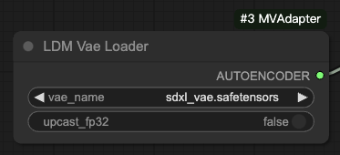
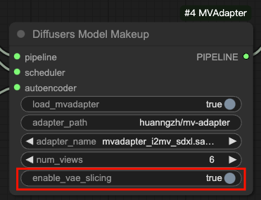
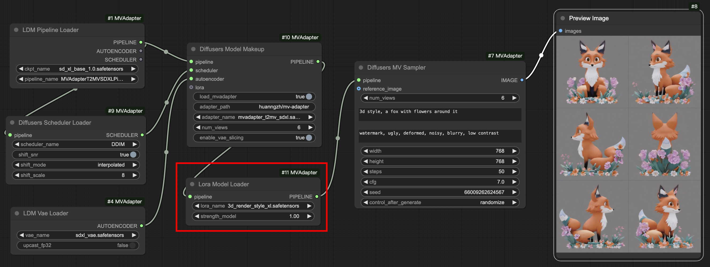
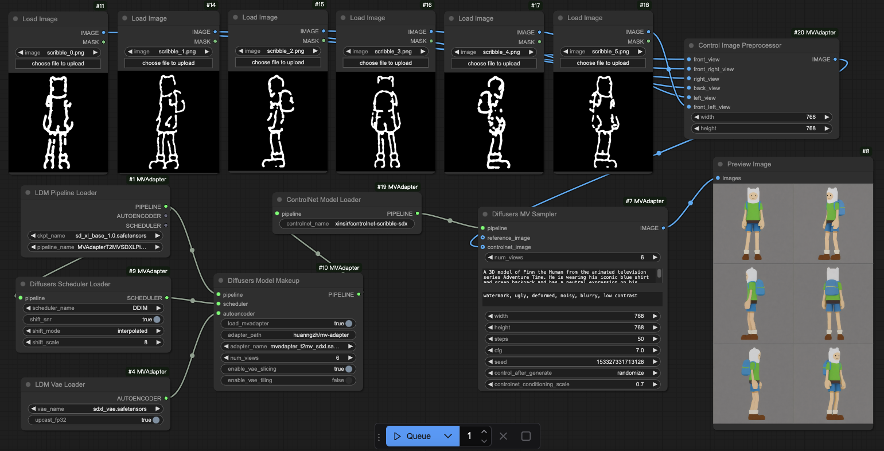
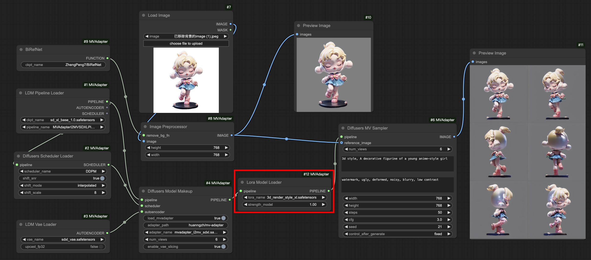
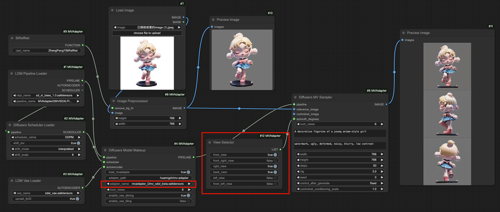

# ComfyUI-MVAdapter

This extension integrates [MV-Adapter](https://github.com/huanngzh/MV-Adapter) into ComfyUI, allowing users to generate multi-view consistent images from text prompts or single images directly within the ComfyUI interface.

## 🔥 Feature Updates

* [2025-06-26] Support multiple loras for multi-view synthesis [See [here](https://github.com/huanngzh/ComfyUI-MVAdapter/pull/96)]
* [2025-01-15] Support selection of generated perspectives, such as generating only 2 views (front&back) [See [here](#view-selection)]
* [2024-12-25] Support integration with ControlNet, for applications like scribble to multi-view images [See [here](#with-controlnet)]
* [2024-12-09] Support integration with SDXL LoRA [See [here](#with-lora)]
* [2024-12-02] Generate multi-view consistent images from text prompts or a single image

## Installation

### From Source

* Clone or download this repository into your `ComfyUI/custom_nodes/` directory.
* Install the required dependencies by running `pip install -r requirements.txt`.

## Notes

### Workflows

We provide the example workflows in `workflows` directory.

Note that our code depends on diffusers, and will automatically download the model weights from huggingface to the hf cache path at the first time. The `ckpt_name` in the node corresponds to the model name in huggingface, such as `stabilityai/stable-diffusion-xl-base-1.0`.

We also provide the nodes `Ldm**Loader` to support loading text-to-image models in `ldm` format. Please see the workflow files with the suffix `_ldm.json`.

### GPU Memory

If your GPU resources are limited, we recommend using the following configuration:

* Use [madebyollin/sdxl-vae-fp16-fix](https://huggingface.co/madebyollin/sdxl-vae-fp16-fix) as VAE. If using ldm-format pipeline, remember to set `upcast_fp32` to `False`.

* Set `enable_vae_slicing` in the Diffusers Model Makeup node to `True`.

However, since SDXL is used as the base model, it still requires about 13G to 14G GPU memory.

## Usage

### Text to Multi-view Images

#### With SDXL or other base models

* `workflows/t2mv_sdxl_diffusers.json` for loading diffusers-format models
* `workflows/t2mv_sdxl_ldm.json` for loading ldm-format models

#### With LoRA

`workflows/t2mv_sdxl_ldm_lora.json` for loading ldm-format models with LoRA for text-to-multi-view generation

#### With ControlNet

`workflows/t2mv_sdxl_ldm_controlnet.json` for loading diffusers-format controlnets for text-scribble-to-multi-view generation

### Image to Multi-view Images

#### With SDXL or other base models

* `workflows/i2mv_sdxl_diffusers.json` for loading diffusers-format models
* `workflows/i2mv_sdxl_ldm.json` for loading ldm-format models

#### With LoRA

`workflows/i2mv_sdxl_ldm_lora.json` for loading ldm-format models with LoRA for image-to-multi-view generation

#### View Selection

`workflows/i2mv_sdxl_ldm_view_selector.json` for loading ldm-format models and selecting specific views to generate

The key is to replace the `adapter_name` in `Diffusers Model Makeup` with `mvadapter_i2mv_sdxl_beta.safetensors`, and add a `View Selector` node to choose which views you want to generate. After a rough test, the beta model is better at generating 2 views (front&back), 3 views (front&right&back), 4 views (front&right&back&left). Note that the attribute `num_views` is not used and can be ignored.
