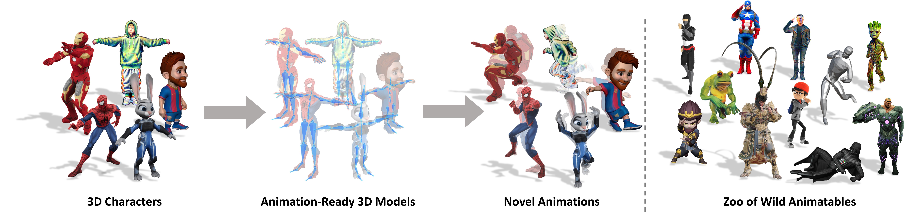

<div align="center">

# Make-It-Animatable: An Efficient Framework for Authoring Animation-Ready 3D Characters <br> (CVPR 2025 Highlight)

_**<a href="https://jasongzy.github.io">Zhiyang Guo</a>,
Jinxu Xiang,
Kai Ma,
Wengang Zhou,
Houqiang Li,
<a href="https://www.ran-zhang.com/">Ran Zhang</a>**_

<a href='https://arxiv.org/abs/2411.18197'></a>
<a href='https://jasongzy.github.io/Make-It-Animatable/'></a>
<a href='https://huggingface.co/spaces/jasongzy/Make-It-Animatable'></a>



</div>

## Installation

```bash
git clone https://github.com/jasongzy/Make-It-Animatable --recursive --single-branch
cd Make-It-Animatable

conda create -n mia python=3.11
conda activate mia
pip install -r requirements.txt
```

## Data Preparation

First of all, get the Git LFS placeholder files (only metadata, won't download the actual data content):

```bash
git lfs install
GIT_LFS_SKIP_SMUDGE=1 git -C data clone https://huggingface.co/datasets/jasongzy/Mixamo
# git -C data/Mixamo submodule update --init
GIT_LFS_SKIP_SMUDGE=1 git clone https://huggingface.co/jasongzy/Make-It-Animatable /tmp/hf-data  # can be deleted later
```

Now download some data required for both training and demo:

```bash
git -C data/Mixamo lfs pull -I 'bones*.fbx,animation'
```

### For Demo

Download the pretrained models:

```bash
git -C /tmp/hf-data lfs pull -I output/best/new
mkdir -p output/best && cp -r /tmp/hf-data/output/best/new output/best/
```

Download the example data:

```bash
git -C /tmp/hf-data lfs pull -I data
cp -r /tmp/hf-data/data/* data/
```

Download some tools:

```bash
wget https://github.com/facebookincubator/FBX2glTF/releases/download/v0.9.7/FBX2glTF-linux-x64 -O util/FBX2glTF
chmod +x util/FBX2glTF
```

### For Training

Download the training dataset:

```bash
git -C data/Mixamo lfs pull -I 'bones*.fbx,animation,animation_extra,character_refined,character_rabit_refined'
```

Download the [pretrained](https://github.com/1zb/3DShape2VecSet#balloon-sampling) weights of AE (**only for training from scratch**):

```bash
git -C /tmp/hf-data lfs pull -I output/ae
cp -r /tmp/hf-data/output/ae output/
```

<details>

<summary>About the online pairing of FBX files</summary>

During training, we do online pairing of characters and animations (skeletal motion sequences) using Blender to reduce the storage size of dataset while ensuring the diversity of training samples.
This basically includes the following steps (implemented using Blender's `bpy` API):

- Sample a character and a motion sequence, apply the motion to the character to create animated sequences, and optionally do retargeting for better poses.
- Sample some frames from the animated sequences to get the training samples of the current iteration.
- Extract the necessary ground-truth data (blend weights, bone positions, poses, etc.) for all sampled frames.
- Sample some points from the surface of the animated mesh as the input shape representation.

So if you want to get rid of the Blender dependency during training, you can iterate through the entire dataset in advance and store the results (may take a lot of storage space).

</details>

## Demo for Inference

```bash
python app.py
```

An online demo is also available at [Hugging Face Spaces](https://huggingface.co/spaces/jasongzy/Make-It-Animatable).

## Training

```bash
bash train.sh
```

Tips:

- For the flexibility and efficiency during training, the models for predicting weights, bones, and poses are trained separately. If you wish to train them jointly and share decoder parameters across them, just modify the `train.sh` script by enabling all `--predict_*` flags.
- The hyperparameters in `train.sh` are set for training on A100 80G GPU. To reduce the VRAM usage, consider decreasing the `--batch_size` and `--sample_frames` values.

## Differences to Paper

- The dual-quaternion representation adopted in learning pose-to-rest transformations is replaced by a more effective rotation representation [ortho6d](https://openaccess.thecvf.com/content_CVPR_2019/html/Zhou_On_the_Continuity_of_Rotation_Representations_in_Neural_Networks_CVPR_2019_paper.html) along with the joint positions.
- Some samples from the [3DBiCar Dataset](https://gaplab.cuhk.edu.cn/projects/RaBit/dataset.html) proposed in [RaBit](https://gaplab.cuhk.edu.cn/projects/RaBit/) (rigged by [Mixamo](https://www.mixamo.com/)) are included in training to improve the generalization to characters with unusual head-body ratio.

## Acknowledgement

- [1zb/3DShape2VecSet](https://github.com/1zb/3DShape2VecSet)
- [Adobe Mixamo](https://www.mixamo.com/)
- [3DGS Render Blender Addon by KIRI Engine](https://github.com/Kiri-Innovation/3dgs-render-blender-addon)

## Citation

```bibtex
@inproceedings{Guo_2025_CVPR,
    author={Guo, Zhiyang and Xiang, Jinxu and Ma, Kai and Zhou, Wengang and Li, Houqiang and Zhang, Ran},
    title={Make-It-Animatable: An Efficient Framework for Authoring Animation-Ready 3D Characters},
    booktitle={Proceedings of the IEEE/CVF Conference on Computer Vision and Pattern Recognition (CVPR)},
    year={2025},
}
```

[](https://star-history.com/#jasongzy/Make-It-Animatable&Date)
